---

title: 光学复习
sidebar_position: 1
date: 2026-06-13
tags: [Optics, Physics, Review Notes, Electromagnetic Theory]

---

# 光学复习

本文是2026年春季近代光学的复习笔记，授课老师是戴亚男老师，参考书目是 Hecht 的《光学》第五版。

本文是*重点导向*的复习：内容只涉及到了戴亚男老师复习课上提到的重点内容，并且在具体公式推导上省略了很多我觉得显然的内容。因此如果想系统学习光学，还是建议参考教科书。

> 尽管如此，我并不是很推荐直接去看 Hecht 的书，它的符号约定非常复杂，甚至有自相矛盾的地方，并且很多内容并不必要，比起教科书更像是科普书。

Chapter 1、2 太过简单，略去。

## Chpater 3: 电磁理论、光子和光

### 3.1 基本定义

#### 辐照度

**辐照度** $I$ 是电磁波在单位面积、单位时间内传输的平均能量。对于真空中的简谐波，**时间平均坡印廷矢量**的大小即为辐照度（单位：$\mathrm{W/m^2}$）：

$$
I = \langle S \rangle_{T} = c^{2}\epsilon_{0}\,|\vec{E}_{0}\times \vec{B}_{0}|\;\langle \cos^{2}(\vec{k}\cdot \vec{r} -\omega t)\rangle
     = \frac{c^{2}\epsilon_{0}}{2}\,|\vec{E}_{0}\times \vec{B}_{0}|
$$

真空中 $|\vec{B}_{0}| = |\vec{E}_{0}|/c$，因此辐照度正比于电场振幅的平方：

$$
I = \langle S \rangle_{T} = \frac{c\,\epsilon_{0}}{2}\,E_{0}^{2}
$$

穿过面积 $A$ 的功率 $P$（瓦特）为

$$
P = IA \qquad [\mathrm{W} = \mathrm{J/s}]
$$

---

#### 球面波

均匀介质中的点源辐射球面波。由标量波动方程可得：

$$
E(r,t) = \left(\frac{\mathcal{A}}{r}\right)\cos(kr \mp \omega t)
$$

其中 $\mathcal{A}$ 为源强。在任意距离 $r$ 处，$rE_0(r) = \text{const}$。因此振幅随 $r$ 成反比下降，点源的辐照度遵循平方反比律：

$$
I \propto \frac{1}{r^{2}}.
$$

注意，对于电磁波而言，实际上并不存在球面波。这是因为高斯定理 $\nabla \cdot \vec{E} = \dfrac{\rho}{\epsilon}$ 强行抹除了电荷分布的所有差别，你没有办法构造一种电荷分布和运动使其产生球面波。当然，这会是很好的近似。

---

#### 光子通量

对于横截面积为 $A$ 的准单色光束，平均光子通量（每秒光子数）为

$$
\Phi = \frac{AI}{h\nu_0}
$$

单个光子携带能量 $E = h\nu$（$h$ 为普朗克常数）。数值上，$P = 1$ mW 的 He–Ne 激光（$\lambda = 632.8\;\mathrm{nm}$）每秒约发出 $ \Phi \approx 3.2 \times 10^{15}\;\text{个光子}.$

---

#### 辐射压

麦克斯韦指出电磁辐射携带动量。瞬时辐射压力等于能量密度：

$$
P_r = u_E + u_B = \frac{S(t)}{c}
$$

作用在全吸收表面上的平均辐射压为

$$
\langle P_r \rangle = \frac{\langle S(t) \rangle}{c} = \frac{I}{c}
$$

单位：$[P_r] = \mathrm{W\,m^{-2}} / \mathrm{m\,s^{-1}} = \mathrm{N\,m^{-2}} \,(\text{帕斯卡})$。

作用在吸收面积 $A$ 上的力为 $F = AP_r$。假设电磁动量的体密度为 $p_v$，则有：

$$
F = \frac{p_v \cdot c\Delta t A}{\Delta t},
$$

连立解得：

$$
p_v = \frac{S}{c^2}
$$

在光子图像中，每个量子携带动量

$$
p = \frac{E}{c} = \frac{h}{\lambda} = \hbar k
$$

---

### 3.2 光在物质中的传播

在无自由电荷与电流的、均匀、各向同性的、线性本构关系的介质中，麦克斯韦方程组化为：

$$
\nabla^2 \vec{E} = \mu \epsilon \frac{\partial{\vec{E}}}{\partial t}, \qquad \nabla^2 \vec{B} = \mu \epsilon \frac{\partial{\vec{B}}}{\partial t},
$$

这是典型的波动方程，行波解：

$$
\vec{E}(\vec{r}, t) = \vec{E}_0 e^{i\left(\vec{k}\cdot \vec{r} - \omega t\right)}, \qquad \vec{B}(\vec{r}, t) = \frac{1}{v}\left(\hat{k} \times \vec{E}\right),
$$

这里利用了另外两条麦克斯韦方程组来化简。这要求电磁波是横波。

定义相速度，即等相位面 $kx-\omega t=\text{const}$ 运动的速度：

$$
v_p = \frac{\mathrm{d}x}{\mathrm{d}t} = \frac{\omega}{k},
$$

将解带入麦克斯韦方程可以证明：$v_p = \dfrac{1}{\sqrt{\mu\epsilon}}$。特别地，真空中的光速为 $c = \dfrac{1}{\sqrt{\mu_0\epsilon_0}}$。

（绝对）**折射率**定义为

$$
n \equiv \frac{c}{v_p} = \frac{c}{\omega}k = \sqrt{\frac{\epsilon\mu}{\epsilon_0\mu_0}}
$$

对于非磁性材料（$\mu \approx \mu_0$），可简化为

$$
\boxed{n = \sqrt{\frac{\epsilon}{\epsilon_0}} = \sqrt{K_E}}
$$

其中 $K_E$ 为介电常数：$\epsilon = K_E \epsilon_0$。

介电常数是依赖于光的频率的：$K_E=K_E(\omega)$，因此相速度、折射率也都是依赖于频率的，这被称为色散。

:::note[色散名称的由来]

为什么叫色散呢？可以想像：对于相同的波矢 $k$，不同频率的光具有不同的相速度 $v_p(\omega)$，这个依赖是正相关的，因此频率低的光要慢一些，频率高的光快一些。而频率是对应着光的颜色的：低频率光是红色，高频率光是紫色。因此，在介质中，不同颜色的光会随着时间的推移逐渐分离开来。这就是色“散”。这个概念被推广到了许多其他地方，尽管那些领域里并没有什么颜色。

:::

:::note[术语约定]

Hecht 书称 $\epsilon$ 为电容率，$K_E$ 为介电常数。是一种与通常习惯不同的但很无聊的约定。

:::

---

#### 群速度

已知介质中电磁波的[色散关系](#5-光在物质中的传播--折射率与色散)为：

$$
\omega = v_p k = \frac{c}{n(\omega)}k,
$$

对 $k$ 求导，得到：

$$
\frac{\mathrm{d}\omega}{\mathrm{d}k} = \frac{c}{n(\omega)} - \frac{ck}{n^2(\omega)}\frac{\mathrm{d}n}{\mathrm{d}k} = \frac{1}{n(\omega)}\left(c - \omega\frac{\mathrm{d}n}{\mathrm{d}\omega}\frac{\mathrm{d}\omega}{\mathrm{d}k}\right)
$$

定义**群速度** $v_g = \dfrac{\mathrm{d}\omega}{\mathrm{d} k}$，解得：

$$
v_g = \cfrac{c}{n(\omega) + \omega\cfrac{\mathrm{d}n}{\mathrm{d}\omega}}.
$$

这描述的是波包（中心）的传播速度，它在某些奇异的色散关系下可以超光速。

#### 洛伦兹振子模型

在经典图像中，束缚电子作为阻尼谐振子响应驱动电场。设单位体积内有 $N$ 个分子，每个分子有 $Z$ 个电子，每个跃迁 $j$ 具有固有频率 $\omega_{0j}$ 和振子强度 $f_j$：

$$
n^{2}(\omega) = 1 + \frac{N q_e^{2}}{\epsilon_0 m_e} \sum_{j} \frac{f_j}{\omega_{0j}^{2} - \omega^{2}},
\qquad
\sum_j f_j = Z.
$$

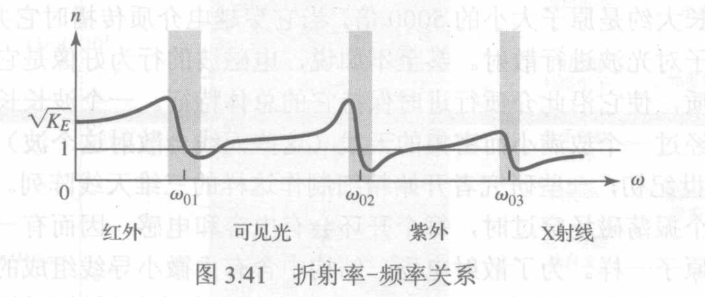

- 正常色散：远离共振时 $n$ 随 $\omega$ 增大而增大。
- 反常色散：在共振频率附近 $n$ 随 $\omega$ 增大而减小，此处发生强烈吸收。简单的无阻尼模型在 $\omega = \omega_{0j}$ 处发散，实际处理需加入阻尼项 $\propto \gamma\,\mathrm{d}\mathbf{r}/\mathrm{d}t$ 以保持 $n$ 有限。

在共振频率略高处，介电函数可以变为负值（例如金属在等离子体频率以下，或某些超材料中）。这导致了全外反射等现象以及负折射的可能性。

---

## Chapter 4: 光的传播

### 4.1 反射和折射

#### 惠更斯原理

**惠更斯原理**指出：波前上的每一点都可以视为产生次级球面子波的波源，此后任意时刻的新波前是这些子波的包络面。

可以利用惠更斯原理证明反射与斯涅尔定律。

#### 费马原理

设光在折射率为 $n(\vec{r})$ 的（非均匀）介质中沿路径 $C$ 传播，定义光程为折射率沿路径的积分：

$$
\text{OPL} = \int_C n(\vec{r}) \, \mathrm{d}s
$$

其中 $ds$ 是路径的弧长微元。物理意义：

$$
n(\vec{r})\,\mathrm{d}s = \frac{c}{v_p(\vec{r})}\,\mathrm{d}s = \frac{c\,\mathrm{d}t}{v_p(\vec{r})}\frac{\mathrm{d}s}{\mathrm{d}t} = c\,\mathrm{d}t,
$$

即光程是在相同时间内，光在真空中传播的路径长度。

**费马原理**：光在 $A$、$B$ 两点间传播的实际路径使光程取驻值，即光程的一阶变分为零：

$$
\delta\int_A^B n\,\mathrm{d}s = 0
$$

通常为极小值，但在某些情况下也可能是极大值或鞍点。例如，光在凹面镜上反射时可能对应极大光程；在均匀介质中直线传播对应极小光程。

由费马原理可推导出反射定律、斯涅尔定律以及光在非均匀介质中的弯曲轨迹。

#### 反射定律

入射角等于反射角：$\theta_i = \theta_r$。

#### 斯涅尔定律与全反射

在折射率分别为 $n_i$ 和 $n_t$ 的两种介质界面上：

$$
n_i \sin\theta_i = n_t \sin\theta_t
$$

等价地，

$$
\frac{\sin\theta_i}{\sin\theta_t} = \frac{n_t}{n_i} \equiv n_{ti}
$$

其中 $n_{ti}$ 是介质 $t$ 相对于介质 $i$ 的相对折射率。

从光密介质到光疏介质（$n_i > n_t$）时，斯涅尔定律给出 $\sin\theta_t = (n_i/n_t) \sin\theta_i$。若 $\sin\theta_i$ 超过 $n_t/n_i$，则不存在实数 $\theta_t$，因此不存在折射波，波被全反射回光密介质。

**临界角**定义为

$$
\sin\theta_c = \frac{n_t}{n_i} = n_{ti}
$$

此时 $\theta_t = 90^{\circ}$，刚好沿着界面传播。

---

### 4.2 菲涅耳方程

根据电动力学，我们可以计算透射波与反射波的振幅强度，这依赖于偏振态。设波为 $\vec{E}_a = \vec{E}_{0a}e^{i\left(\vec{k}_a \cdot \vec{r} - \omega t\right)}$，其中 $a$ 取 $i$ 代表入射波、取 $r$ 代表反射波、取 $t$ 代表透射波。

电动力学保证了三个波的频率 $\omega$ 是相同的，并且给定电场可以完全地决定磁场：$\vec{B}(\vec{r}, t) = \dfrac{1}{v}\left(\vec{k} \times \vec{E}\right)$；将坐标原点选取在入射点处可以消除掉反射波和透射波额外的相位。

定义：

$$
r_k = \left(\frac{E_{0r}}{E_{0i}}\right)_k， \qquad t_k = \left(\frac{E_{0t}}{E_{0i}}\right)_k
$$

其中 $k$ 可取 $\perp$，代表电场与入射平面垂直；也可取 $\parallel$，代表电场与入射平面平行。具体可参考图片。

1. TE 偏振（$E$ 垂直于入射面）：

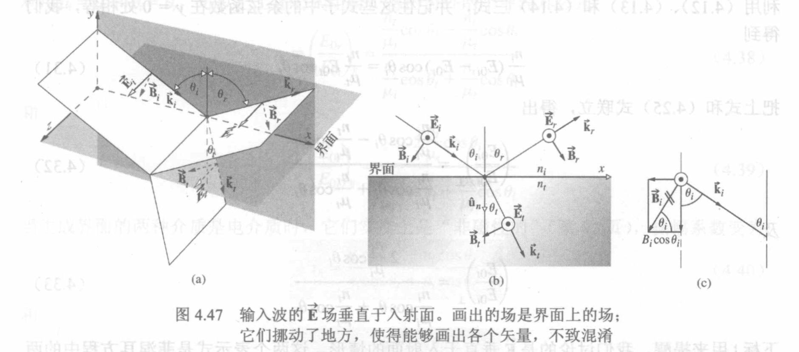

$$
r_{\perp} = \cfrac{\cfrac{n_i}{\mu_i} \cos\theta_i - \cfrac{n_t}{\mu_t} \cos\theta_t}{\cfrac{n_i}{\mu_i} \cos\theta_i + \cfrac{n_t}{\mu_t} \cos\theta_t}
\qquad
t_{\perp} = \cfrac{2\cfrac{n_i}{\mu_i} \cos\theta_i}{\cfrac{n_i}{\mu_i} \cos\theta_i + \cfrac{n_t}{\mu_t} \cos\theta_t}
$$

2. TM 偏振（$E$ 平行于入射面）：

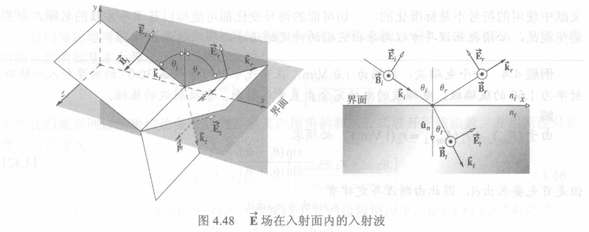

$$
r_{\parallel} = \cfrac{\cfrac{n_t}{\mu_t} \cos\theta_i - \cfrac{n_i}{\mu_i} \cos\theta_t}{\cfrac{n_i}{\mu_i} \cos\theta_t + \cfrac{n_t}{\mu_t} \cos\theta_i}
\qquad
t_{\parallel} = \cfrac{2\cfrac{n_i}{\mu_i} \cos\theta_i}{\cfrac{n_t}{\mu_t} \cos\theta_i + \cfrac{n_i}{\mu_i} \cos\theta_t}
$$

:::caution[符号约定]

注意：$r$ 的符号取决于推导中反射 $E$ 场方向的选取，我们按照 Hecht 光学（第五版）的约定，也就是图片给出的方向。

:::

对于非磁性介质 ($\mu_i\approx\mu_t\approx 1$)，**菲涅尔方程**化简为：

$$
r_{\perp} = \frac{n_i \cos\theta_i - n_t \cos\theta_t}{n_i \cos\theta_i + n_t \cos\theta_t}
\qquad
t_{\perp} = \frac{2n_i \cos\theta_i}{n_i \cos\theta_i + n_t \cos\theta_t}
$$
$$
r_{\parallel} = \frac{n_t \cos\theta_i - n_i \cos\theta_t}{n_i \cos\theta_t + n_t \cos\theta_i}
\qquad
t_{\parallel} = \frac{2n_i \cos\theta_i}{n_i \cos\theta_t + n_t \cos\theta_i}
$$

利用斯涅尔定律，上式可进一步简化为：

$$
r_{\perp} = -\frac{\sin(\theta_i-\theta_t)}{\sin(\theta_i+\theta_t)}
\qquad
t_{\perp} = +\frac{2\sin\theta_t\cos\theta_i}{\sin(\theta_i+\theta_t)}
$$
$$
r_{\parallel} = +\frac{\tan(\theta_i-\theta_t)}{\tan(\theta_i+\theta_t)}
\qquad
t_{\parallel} = +\frac{2\sin\theta_t\cos\theta_i}{\sin(\theta_i+\theta_t)\cos(\theta_i-\theta_t)}
$$

可以定义反射率 $R$ 和透射率 $T$：

$$
\begin{aligned}
R_{\perp} &= r_{\perp}^{2}, & T_{\perp} &= \left(\frac{n_t \cos\theta_t}{n_i \cos\theta_i}\right) t_{\perp}^{2} \\
R_{\parallel} &= r_{\parallel}^{2}, & T_{\parallel} &= \left(\frac{n_t \cos\theta_t}{n_i \cos\theta_i}\right) t_{\parallel}^{2}
\end{aligned}
$$

它们代表功率（辐照度）比。在无吸收的条件下，$R+T=1$，也即能量守恒。

### 4.3 倏逝波

在全内反射条件下，实际上仍然存在透射波：

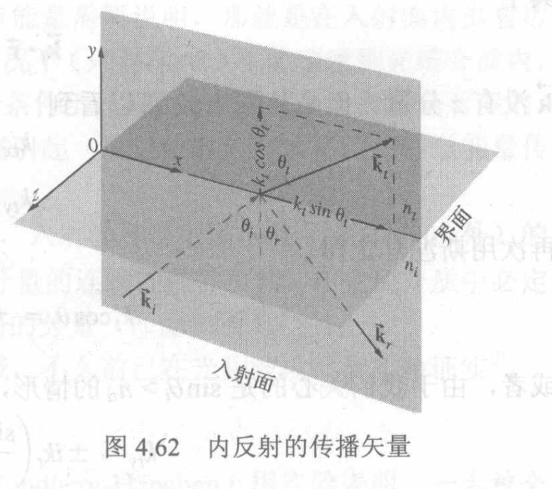

透射波的波矢：$\vec{k}_t = (k_{tx}, k_{ty}, 0)$，如图，由几何关系：

$$
k_{tx} = k_t \sin{\theta_t}, \qquad k_{ty} = k_t \cos{\theta_t},
$$

对于全反射，我们无法确定 $\theta_t$，因此我们通过寻找斯涅尔定律的等价表述，将全部有关 $\theta_t$ 的量用 $\theta_i$表示出来：

$$
n_i \sin\theta_i = n_t \sin\theta_t \Longrightarrow n_i \cos\theta_i = n_t \cos\theta_t,
$$

即：

$$
n_t\cos\theta_t = n_i\sqrt{1-\sin^2\theta_t} = n_i\sqrt{1-\frac{\sin^2\theta_i}{n_{ti}^2}}
$$

由于 $n = \dfrac{c}{v_p} = \dfrac{c}{\omega} k$，因此有：

$$
k_y = k_t\cos\theta_t =  k_i\sqrt{1-\frac{\sin^2\theta_i}{n_{ti}^2}},
\qquad
k_x = k_t \frac{\sin\theta_i}{n_{ti}}
$$

以上的论述对于任意角度的入射都成立。接下来考虑入射角度大于临界角，发生全反射时的情况:

$$
\sin\theta_t = \frac{\sin\theta_i}{n_{ti}} \geq 1,
$$

得到：

$$
k_{ty} = ik_t\sqrt{\frac{\sin^2\theta_i}{n_{ti}^2} - 1} \equiv i\beta
$$

其中衰减系数定义为：

$$
\beta = k_t \sqrt{\frac{\sin^{2}\theta_i}{n_{ti}^{2}} - 1}.
$$

$k_x$ 不变。因此，透射波可以写作：

$$
\vec{E}_t = \vec{E}_{0t}\exp\left[i\left(\vec{k}\cdot\vec{r} - \omega t\right)\right] = \vec{E}_{0t} e^{-\beta y}\exp\left[i\left(k_t\frac{\sin\theta_i}{n_{ti}}x - \omega t\right)\right]
$$

即振幅随距界面的距离 $y$ 指数衰减。定义**穿透深度**为：$\delta = 1/\beta$，此时振幅衰减为初始的 $1/e$。穿透深度通常在一个波长的量级。

#### 受抑全内反射（FTIR）

若将光密介质置于距界面非常近的位置，近到连倏逝波都还保留着一定可观的振幅时，倏逝场可将能量耦合穿过间隙，在新的光密介质中出现可传播的电磁波。这种效应类似量子隧穿，透射系数 $T \propto e^{-2\beta d}$。

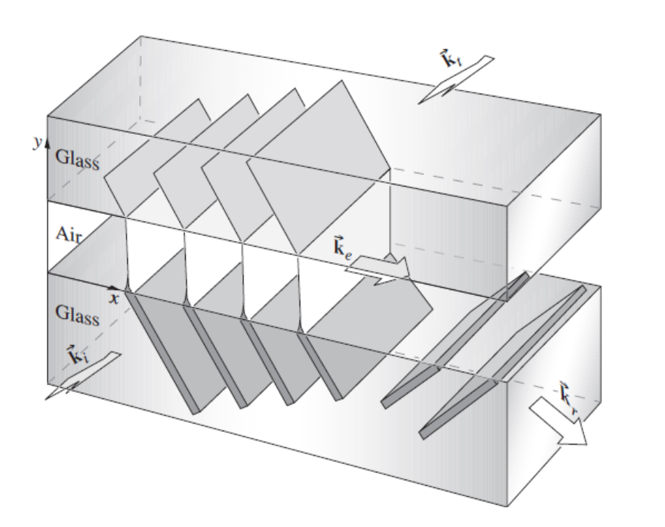

---

## Chapter 5: 几何光学

### 5.1 球面透镜

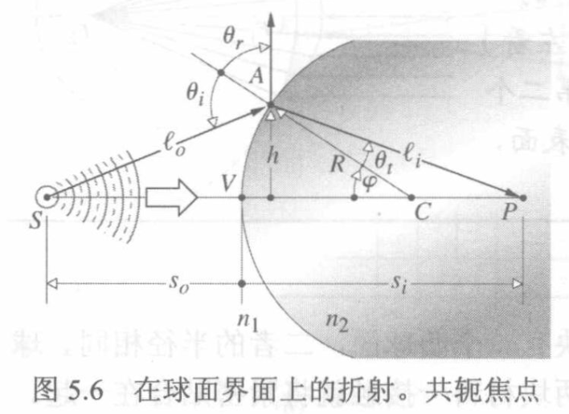

如图。光程为 $\text{OPL} = n_1 l_o + n_2 l_i$。利用余弦定理：

$$
l_o = \left(R^2 + (s_o+R)^2 - 2R(s_o+R)\cos\varphi \right)^{\frac{1}{2}}, \qquad l_i = \left(R^2 + (s_i-R)^2 + 2R(s_i-R)\cos\varphi \right)^{\frac{1}{2}},
$$

费马原理给出：

$$
\frac{d}{d\varphi} \text{OPL} = 0 \Longrightarrow \frac{n_1(s_o+R)}{l_o} + \frac{n_2(s_i-R)}{l_i} = 0,
$$

等价地：

$$
\frac{n_1}{l_o} + \frac{n_2}{l_i} = \frac{1}{R}\left(\frac{n_2s_i}{l_i} - \frac{n_1s_o}{l_o}\right).
$$

小角情况下，$s_i \approx l_i$，$s_o \approx l_o$，因此有：

$$
\frac{n_1}{s_o} + \frac{n_2}{s_i} = \frac{n_2-n_1}{R},
$$

这被称为**傍轴近似**，或者**高斯近似**。

若入射光出射为平行光（$s_i=\infty$），定义第一焦距（物方焦距）为:
$$
f_o = \lim_{s_i \to \infty}s_o = \frac{n_1}{n_2-n_1}R
$$

类似地，对于平行光入射（$s_o=\infty$）：定义第二焦距（像方焦距）为:
$$
f_i = \lim_{s_o \to \infty}s_i = \frac{n_2}{n_2-n_1}R
$$

### 5.2 薄透镜

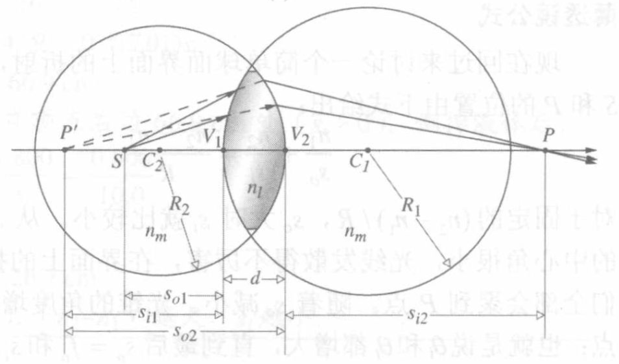

透镜是两个球面镜的叠加。

:::note[符号说明]

注意：虽然这张图把第一个球面的像点 $P'$ 画在了透镜左侧，但实际上是没有影响的，公式的形式都会保持不变，区别是这里计算出来的 $s_{i1}$ 是负数，代表虚像；而像点 $P'$落在透镜右侧（甚至内部）时 $s_{i1}$ 是正数（实像）。类似地，这里的 $R_2$ 也应该认为是负数，因为光从内向外射。

:::

与先前的讨论一致，傍轴近似下，第一个球面：

$$
\frac{n_m}{s_{o1}} + \frac{n_l}{s_{i1}} = \frac{n_l-n_m}{R_1},
$$

第二个球面：

$$
\frac{n_l}{s_{o2}} + \frac{n_m}{s_{i2}} = \frac{n_m-n_l}{R_2},
$$

代入几何关系 $s_{o2} = d - s_{i1}$，将两式相加可以得到：

$$
\frac{n_m}{s_{o1}} + \frac{n_m}{s_{i2}} = (n_l-n_m)\left(\frac{1}{R_1} - \frac{1}{R_2}\right) + \frac{n_ld}{(s_{i1}-d)s_{i1}},
$$

特别地：对于薄透镜（$d \to 0$），并且在空气中考虑（$n_m \to 1$），则有：

$$
\frac{1}{s_{o}} + \frac{1}{s_{i}} = (n_l-1)\left(\frac{1}{R_1} - \frac{1}{R_2}\right)
$$

这被称为**透镜制造者公式**。其中，当 $d \to 0$ 时自然有 $s_{o1} = s_{o1} + d \equiv s_o$，对于 $s_i$ 同理。

与先前讨论的类似，我们定义薄透镜的焦距为：
$$
f_o = \lim_{s_i \to \infty}s_o, \qquad f_i = \lim_{s_o \to \infty}s_i,
$$

不难发现对于薄透镜而言两者相等，我们略去下标：
$$
f= \left[(n_l-1)\left(\frac{1}{R_1} - \frac{1}{R_2}\right)\right]^{-1},
$$

因此薄透镜公式还可以写作：
$$
\frac{1}{s_o} + \frac{1}{s_i} = \frac{1}{f}.
$$

#### 放大率

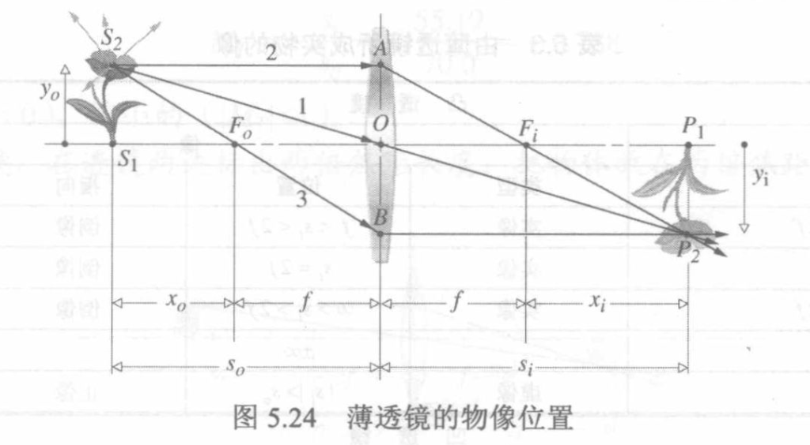

:::info[符号约定]

符号约定：光轴上方距离为正，下方距离为负。因此：$y_o > 0$，$y_i < 0$。

:::

如图，由简单的几何关系可以得到：
$$
x_ox_i=f^2
$$

这被称为牛顿形式的薄透镜公式。它于之前的等价。

:::info[符号约定]

符号约定：$x_o$ 在焦点左侧为正，而 $x_i$ 在焦点右侧为正。

:::

定义透镜的**横向放大率**为：

$$
M_T \equiv \frac{y_i}{y_0} = -\frac{s_i}{s_o} = -\frac{x_i}{f} = -\frac{f}{x_o}.
$$

横向放大率的正/负号对应像的正/倒，大于/小于 $1$ 对应像是放大/缩小的。当且仅当 $s_o=s_i=2f$ 时 $M_T=-1$，此时形成倒立等大的实像。

定义透镜的**纵向放大率**为：

$$
M_L \equiv \frac{\mathrm{d}x_i}{\mathrm{d}x_o},
$$

它是像空间中一个无穷小的轴向长度与物空间中对应长度的比值。对于单一介质中的单一透镜，其纵向放大率为：

$$
M_L = -\frac{f^2}{x_o^2} = -M_T^2
$$

#### 像的类型总结

| 透镜类型 | 物体位置 | 像类型 | 像位置 | 方向 | 相对大小 |
|---------|---------|--------|--------|------|---------|
| 凸透镜 | $\infty > s_o > 2f$ | 实 | $f < s_i < 2f$ | 倒立 | 缩小 |
| 凸透镜 | $s_o = 2f$ | 实 | $s_i = 2f$ | 倒立 | 等大 |
| 凸透镜 | $f < s_o < 2f$ | 实 | $s_i > 2f$ | 倒立 | 放大 |
| 凸透镜 | $s_o = f$ | — | $\pm\infty$ | — | — |
| 凸透镜 | $s_o < f$ | 虚 | $\|s_i\| > s_o$ | 正立 | 放大 |
| 凹透镜 | 任意位置 | 虚 | $\|s_i\| < \|f\|$ | 正立 | 缩小 |

#### 薄透镜组

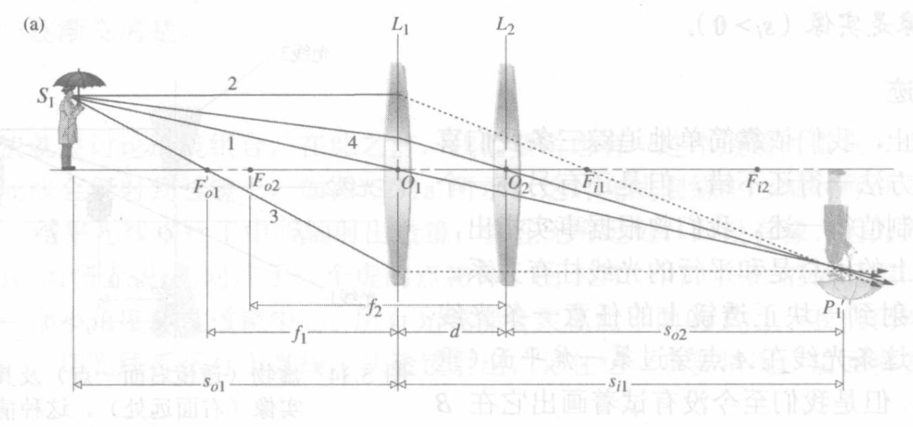

:::note[注意]

尽管这里画的是两个凸透镜，并且透镜间隔 $d$ 小于两个透镜的焦距 $f_i$，但下面的推导对于任意透镜任意距离都是成立的。这里并没有画出第二个透镜的像。

:::

对于 $L_1$ 有：

$$
\frac{1}{s_{i1}} = \frac{1}{f_1} - \frac{1}{s_{o1}} \Longrightarrow s_{i1} = \frac{f_1s_{o1}}{s_{o1}-f_1},
$$

同理对于 $L_2$：

$$
s_{i2} = \frac{f_2s_{o2}}{s_{o2}-f_2}
$$

并且由几何关系：$s_{o2} = d - s_{i1}$，代入可解得：

$$
s_{i2} = \frac{f_2d - f_2s_{o1}f_1 / (s_{o1} - f_1) }{d - f_2 - s_{o1} f_1 /(s_{o1} - f_1)}.
$$

复合透镜的横向放大率总是两个单独放大率的乘积：

$$
M_T = M_{T1}M_{T2} = \frac{f_1s_{i2}}{d(s_{o1}-f_1)-s_{o1}f_1}.
$$

可以类似地定义透镜组的前焦距和后焦距：

$$
\text{前焦距} = \lim_{s_{i2} \to \infty} s_{o1} = \frac{f_1(d-f_2)}{d-(f_1+f_2)}, \qquad \text{后焦距} = \lim_{s_{o1} \to \infty} s_{i2} = \frac{f_2(d-f_1)}{d-(f_1+f_2)},
$$

当透镜间距 $d \to 0$ 时，前后焦距相等，得到：

$$
f = \frac{f_1f_2}{f_1+f_2}.
$$

若有 $N$ 个透镜紧贴在一起，其等效焦距为：

$$
\frac{1}{f} = \sum_{i=1}^N \frac{1}{f_i}.
$$

#### 球面反射镜*

:::note

并非 2026 年重点范围，但是很简单，顺便放进来。

:::

在傍轴近似下，球面反射镜近似于抛物面镜。成像公式：

$$
\frac{1}{s_o} + \frac{1}{s_i} = -\frac{2}{R},
$$

焦距：

$$
f = -\frac{R}{2}.
$$

其成像性质与透镜几乎一致：凹面镜对应凸透镜，凸面镜对应凹透镜。

### 5.3 光纤光学

对于长度为 $L$、纤芯折射率为 $n_f$、包层折射率为 $n_c$、外部为空气（$n_a \approx 1$）的光纤：

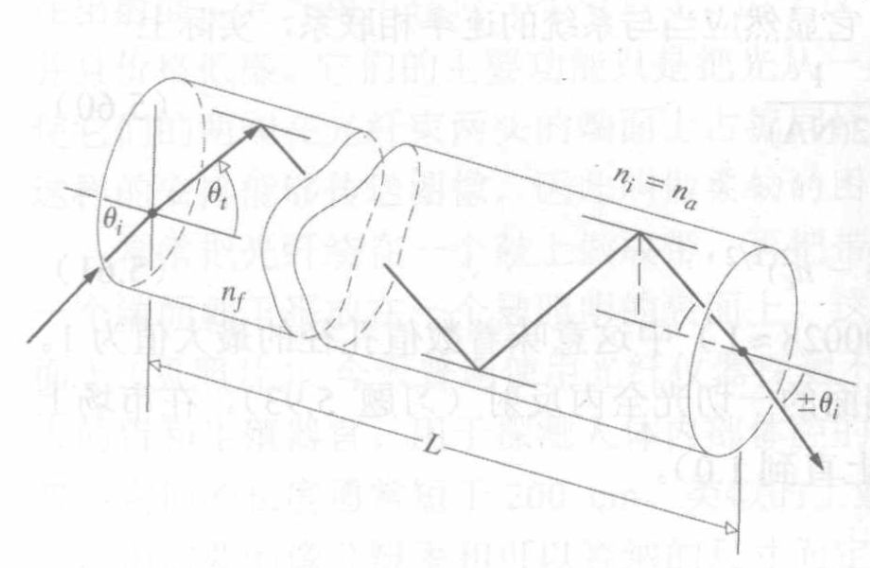

几何路径长度为

$$
l = \frac{L}{\cos\theta_t} = n_f L\,(n_f^{2} - \sin^{2}\theta_i)^{-1/2}
$$

在直径为 $D$ 的光纤内部，反射次数为

$$
N = \frac{l}{D/\sin\theta_t} \pm 1= \frac{L\sin\theta_i}{D\,(n_f^{2} - \sin^{2}\theta_i)^{1/2}} \pm 1
$$

$\pm 1$ 表示舍入到最近的整数去。例：$D = 50\;\mu\mathrm{m}$，$n_f = 1.6$，$\theta_i = 30^{\circ}$ 时，每英尺约 2000 次反射（$\sim 6600$ 次/米）。

#### 模间色散

在多模光纤中，不同光线（模式）经过不同的路径长度，最快的是正入射的光：

$$
t_{\min} = \frac{L}{v_f} = \frac{Ln_f}{c}
$$

最慢的是以全反射临界角入射的光，由几何关系：

$$
\cos\theta_t = \sin\theta_c = \frac{n_c}{n_f},
$$

其中 $n_c$ 是光纤包层的折射率。因此：

$$
t_{\max} = \frac{l}{v_f} = \frac{Ln_f}{c\cos\theta_t} = \frac{Ln_f^2}{cn_c},
$$

因此导致脉冲展宽：

$$
\Delta t = t_{\max} - t_{\min} = \frac{L n_f}{c}\left(\frac{n_f}{n_c} - 1\right)
$$

当展宽大到一定程度时，信号将不可分辨，这限制了单条光纤的长度。

---

## Chapter 6：几何光学的进一步讨论

### 6.1 厚透镜

厚透镜可以当作由顶点相隔一段距离 $d$ 的两个球面折射面所组成来处理，或者当成两个薄透镜组成的透镜组。就像前面推导薄透镜公式时那样，如图：

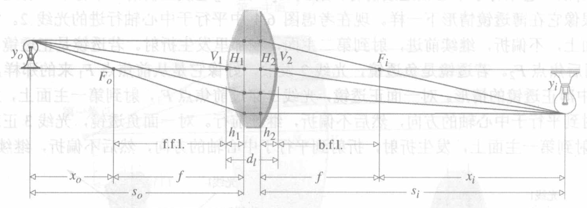

可推导出焦距：

$$
\frac{1}{f} = (n_l-1)\left( \frac{1}{R_1} - \frac{1}{R_2} + \frac{(n_l-1)d_l}{n_lR_1R_2} \right), 
$$

主面的位置（等效薄透镜的位置）：

$$
h_1 = -\frac{f(n_l-1)d_l}{R_2n_l}, \qquad h_2 = -\frac{f(n_l-1)d_l}{R_1n_l}
$$

在空气中的厚透镜的折射可以写作：

$$
\frac{1}{s_o} + \frac{1}{s_i} = \frac{1}{f}，
$$

与之前保持一致，只要 $s_o, s_i$ 是相对于两个主面算起的。同理，牛顿形式的透镜公式也成立：

$$
x_ox_i=f^2,
$$

还有横向放大率：

$$
M_T \equiv \frac{y_i}{y_0} = -\frac{s_i}{s_o} = -\frac{x_i}{f} = -\frac{f}{x_o}.
$$

#### 厚透镜组

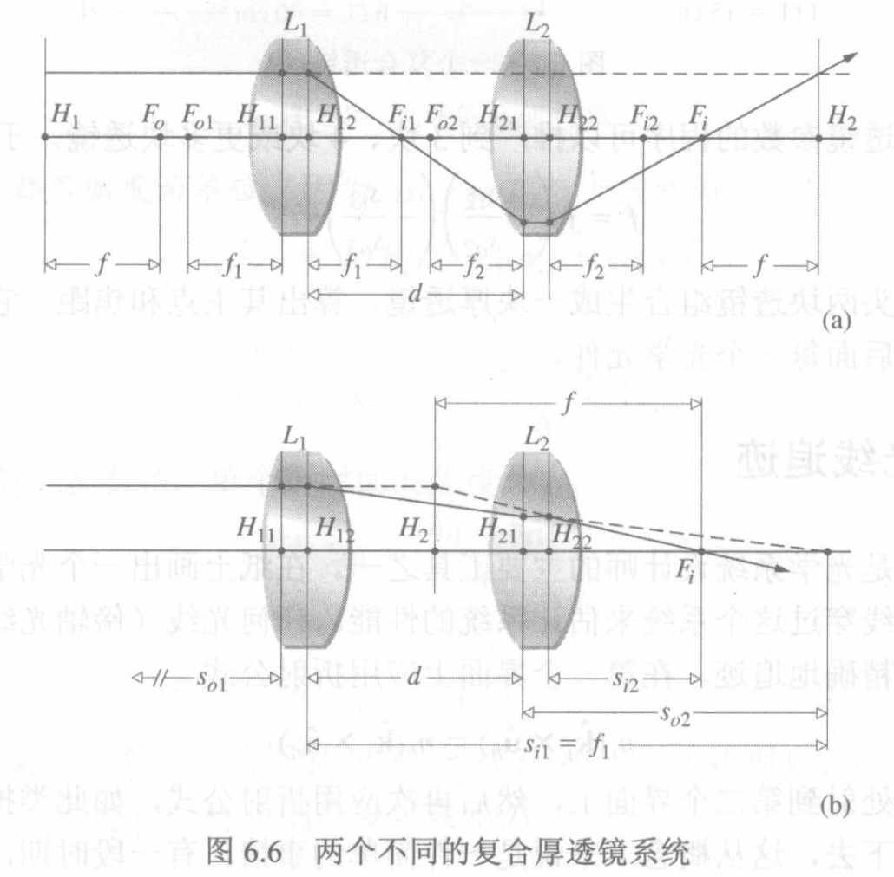

复合透镜的焦距：

$$
\frac{1}{f} = \frac{1}{f_1} + \frac{1}{f_2} - \frac{d}{f_1f_2}
$$

系统整体主面的位置：

$$
\overline{H_{11}H_1} = \frac{fd}{f_2}, \qquad \overline{H_{22}H_2} = \frac{fd}{f_1}.
$$

### 6.2 矩阵方法

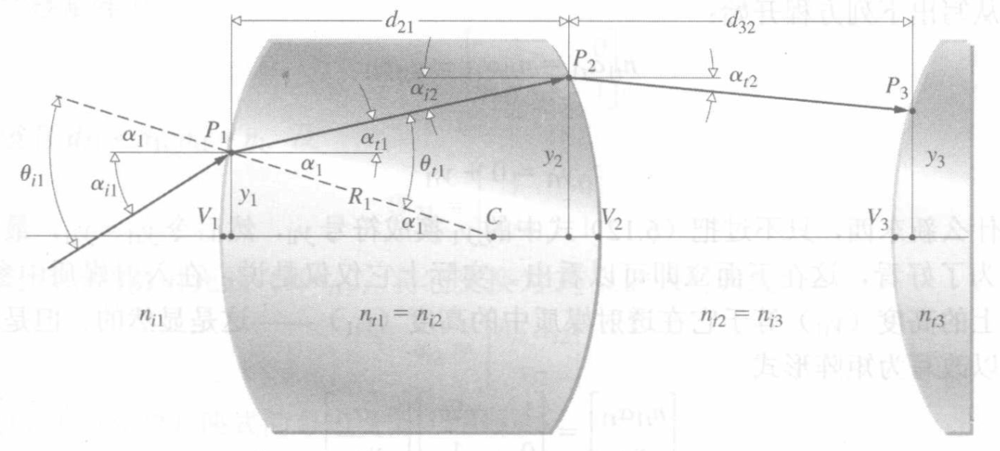

:::caution[注意]

这里图像是严重失真的：傍轴近似下，这些角度都极小，因此直接采用近似 $\theta \approx \sin\theta \approx \tan\theta$。
此外，点 $C$ 是透镜第一个面的圆心，这也是严重失真的。

:::

如图：在 $P_1$ 处应用斯涅尔定律，注意到 $\alpha_1 = \dfrac{y_1}{R_1}$：

$$
n_{i1}\theta_{i1} = n_{t1}\theta_{t1} \Longrightarrow n_{t1}\alpha_{t1} = n_{i1}\alpha_{i1} - \left(\frac{n_{t1}-n_{i1}}{R_1}\right) y_1
$$

定义单个折射面的焦度为：

$$
\mathscr{D}_1 = \frac{n_{t1}-n_{i1}}{R_1},
$$

因此第一个界面上的折射方程：

$$
n_{t1}\alpha_{t1} = n_{i1}\alpha_{i1} - \mathscr{D}_1 y_1,
$$

接下来它穿过均匀折射率的透镜到达 $P_2$ 点，转移方程为：

$$
y_2 = y_1 + d_{21} \alpha_{t1}.
$$

#### 折射矩阵

折射矩阵描述了光线进入透镜/离开透镜的过程。

重写折射方程：

$$
n_{t1}\alpha_{t1} = n_{i1}\alpha_{i1} - \mathscr{D}_1 y_{i1},
$$

并补充平凡项：

$$
y_{t1} = 0 + y_{i1},
$$

即：折射前的光线在折射后的光线在 $P_1$ 处高度相同。于是光线进入/离开透镜的这一过程可以由矩阵方程描述：

$$
\iota_{t1} = \mathscr{R}_1\iota_{i1},
$$

其中：

$$
\iota_k \equiv \begin{pmatrix}
n_k\alpha_k \\
y_k
\end{pmatrix}, \, k=t1, i1, \qquad
\mathscr{R}_1 \equiv \begin{pmatrix}
1 & -\mathscr{D}_1 \\
0 & 1
\end{pmatrix} = 
\begin{pmatrix}
1 & -(n_{t1}-n_{i1})/R_1 \\
0 & 1
\end{pmatrix},
$$

进入透镜的过程中，$n_{t1}$ 表示折射后的介质折射率，也即透镜折射率；$n_{i1}$ 表示折射前介质折射率，也即透镜外介质（通常是空气）折射率。而离开透镜的过程中，$n_{t_2} = n_{i3}$，也即外部介质折射率，通常与 $n_{i1}$ 相等，也通常是空气折射率 $n_a \approx 1$；$n_{i2}=n_{t1}$ 是透镜折射率。

:::note[吐槽]

我不明白为什么符号约定这么混乱，实际上上面讲的都是非常显然的东西。

:::

#### 转移矩阵

转移矩阵描述了光线在介质/透镜内的移动。

平凡项：

$$
n_{i2}\alpha_{i2} = n_{t1}\alpha_{t1} + 0
$$

即点 $P_1$ 处和点 $P_2$ 处的折射率相同，角度相同。

重写转移方程：

$$
y_{i2} = \frac{d_{21}}{n_{t1}} n_{t1} \alpha_{t1} + y_{t1}，
$$

因此光线在透镜内部的转移可以写作矩阵方程：

$$
\iota_{i2} = \mathscr{T}_{21} \iota_{t1}
$$

其中:
$$
\mathscr{T}_{21} = \begin{pmatrix} 1 & 0 \\ d_{21}/n & 1 \end{pmatrix} = \begin{pmatrix} 1 & 0 \\ d_1/n & 1 \end{pmatrix} 
$$

第二个等号代表傍轴近似下 $P_1P_2$ 水平间距近似等于透镜宽度 $d_1$.

转移矩阵同样可以描述光线在空气中的转移，取 $n=1$ 即可。两个透镜间距为 $d$ 时，从第一个透镜出射的光要乘以空气的转移矩阵，然后再到第二个透镜。

#### 系统矩阵

对于厚透镜，光线进入透镜，在内部转移，然后离开透镜，因此整个透镜对光线的作用可以表示为：

$$
\iota_{t2} = \mathscr{R}_2\,\mathscr{T}_{21}\,\mathscr{R}_1\,\iota_{i1}
                     = \begin{pmatrix} a_{11} & a_{12} \\ a_{21} & a_{22} \end{pmatrix} \iota_{i1}
$$

其中，对于单个透镜而言：

$$
\mathscr{A} = 
\begin{pmatrix} a_{11} & a_{12} \\ a_{21} & a_{22} \end{pmatrix} = 
\begin{pmatrix}
1-\dfrac{\mathscr{D}_2d_l}{n_l} & -\mathscr{D}_1-\mathscr{D}_2+\dfrac{\mathscr{D}_2\mathscr{D}_1d_l}{n_l} \\
\dfrac{d_l}{n_l} & 1-\dfrac{\mathscr{D}_1d_l}{n_l}
\end{pmatrix}.
$$

注意，在空气中：

$$
-a_{12} = \mathscr{D}_1+\mathscr{D}_2-\dfrac{\mathscr{D}_2\mathscr{D}_1d_l}{n_l} = (n_l-1)\left( \frac{1}{R_1} - \frac{1}{R_2} + \frac{(n_l-1)d_l}{n_lR_1R_2} \right),
$$

这刚好就是厚透镜的等效焦距。因此可以类似地定义等效焦度：$\mathscr{D}_l = -a_{12}$。

#### 用矩阵方法计算厚透镜公式

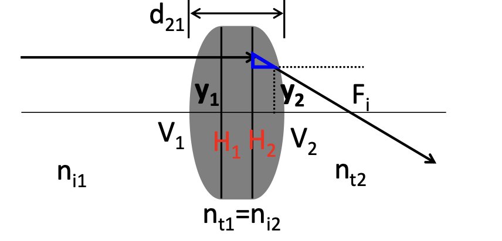

对于平行于光轴入射的光线（$\alpha_{i1} = 0$），高度为 $y_{i1}$：

$$
\begin{bmatrix} n_{t2}\alpha_{t2} \\ y_{t2} \end{bmatrix}
= \begin{bmatrix} a_{11} & a_{12} \\ a_{21} & a_{22} \end{bmatrix}
\begin{bmatrix} 0 \\ y_{i1} \end{bmatrix}
= \begin{bmatrix} a_{12} y_{i1} \\ a_{22} y_{i1} \end{bmatrix}
$$

由几何关系：

$$
f_2 = \frac{y_{i1}}{-\alpha_{t2}} = -\frac{n_{t2}y_{i1}}{n_{t2}\alpha_{t2}} = -\frac{n_{t2}}{a_{12}}
$$

其中角度 $\alpha_{t2}$ 取负数，因为光线向下方传播（斜率为负）。因此透镜后顶点 $V_2$ 到 $H_2$ 的距离：

$$
H_2V_2 = \frac{y_{i1} - y_{t2}}{\alpha_{t2}} = -\frac{y_{i1} - a_{22}y_{i1}}{a_{12}y_{i1}/n_{t2}}
      = -\frac{f\,(n_l - 1)\,d_l}{n_l R_1}
$$

第一焦距类似：

$$
f_1 = H_1F_o = -\frac{n_{i1}}{a_{12}}
\qquad
H_1V_1 = \frac{(a_{11}-1)n_{i1}}{a_{12}} = -\frac{f\,(n_l - 1)\,d_l}{n_l R_2}
$$

#### 薄透镜的矩阵描述

取 $d_l=0$ 即得到薄透镜的矩阵描述：

$$
\mathscr{A} = \mathscr{R_2}\mathscr{T}\mathscr{R_1} = \begin{pmatrix}
1 & -(\mathscr{D}_1 + \mathscr{D}_2) \\
0 & 1
\end{pmatrix},
$$

其中：

$$
\mathscr{D}_1 + \mathscr{D}_2 = \frac{n_l-1}{R_1} - \frac{n_l-1}{R_2} = \frac{1}{f},
$$

正如先前厚透镜一样。因此：

$$
\mathscr{A} =  \begin{pmatrix}
1 & -1/f \\
0 & 1
\end{pmatrix}.
$$

特别地，考虑两个薄透镜的复合，其总系统矩阵为：

$$
\mathscr{A} = \mathscr{A_2}\mathscr{T}\mathscr{A_1} = \begin{pmatrix}
1 & -1/f_2 \\
0 & 1
\end{pmatrix}
\begin{pmatrix}
1 & 0 \\
d & 1
\end{pmatrix}
\begin{pmatrix}
1 & -1/f_1 \\
0 & 1
\end{pmatrix}=
\begin{pmatrix} a_{11} & a_{12} \\ a_{21} & a_{22} \end{pmatrix} = 
\begin{pmatrix}
1-\dfrac{d}{f_2} & -\dfrac{1}{f_2}-\dfrac{1}{f_2}+\dfrac{d}{f_1f_2} \\
d & 1-\dfrac{d}{f_1}
\end{pmatrix}.
$$

总焦距：

$$
\frac{1}{f} = -a_{12} = \frac{1}{f_2}+\frac{1}{f_2}-\frac{d}{f_1f_2}.
$$

由此也可以更加清晰地看待之前厚透镜的系统矩阵：

$$
\mathscr{A} = 
\begin{pmatrix}
1-\dfrac{\mathscr{D}_2d_l}{n_l} & -\mathscr{D}_1-\mathscr{D}_2+\dfrac{\mathscr{D}_2\mathscr{D}_1d_l}{n_l} \\
\dfrac{d_l}{n_l} & 1-\dfrac{\mathscr{D}_1d_l}{n_l}
\end{pmatrix},
$$

注意到 $\mathscr{D}_i = 1/f_i$。因此厚透镜无非是两个薄透镜借用折射率为 $n_l$ 的转移矩阵复合起来而已。

### 6.3 球差

:::note

并非 2026 年重点范围，但是作业题有，担心会考顺便整理进来。

:::

[回忆](#51-球面透镜):

$$
l_o = \left(R^2 + (s_o+R)^2 - 2R(s_o+R)\cos\varphi \right)^{\frac{1}{2}}, \qquad l_i = \left(R^2 + (s_i-R)^2 + 2R(s_i-R)\cos\varphi \right)^{\frac{1}{2}},
$$

并且：

$$
\frac{n_1}{l_o} + \frac{n_2}{l_i} = \frac{1}{R}\left(\frac{n_2s_i}{l_i} - \frac{n_1s_o}{l_o}\right),
$$

以上表达式是精确的。先前我们讨论的都是傍轴近似：$\varphi \ll 1$，此时 $s_o\approx l_o, s_i \approx l_i$。但当这个条件不成立时，我们就需要应用更高阶的修正，这被称作球差。对精确表达式作泰勒展开至 $h^{2}$ 阶就得到了三阶修正，$h$ 是为光线在球面上的入射高度，注意由几何关系： $h = R\sin\varphi$。

:::note[疑问]

这样来看不知道为什么这个修正叫三阶修正了。可能直接对 $\varphi$ 展开到三阶，而不是换元成 $h$ 会得到同样的结果？

:::

首先将 $l_o, l_i$ 改写，利用 $1-\cos\varphi = 2\sin^{2}(\varphi/2)$：

$$
\begin{aligned}
l_o^{2} &= R^{2} + (s_o+R)^{2} - 2R(s_o+R)\cos\varphi \\
        &= s_o^{2} + 2R(s_o+R) - 2R(s_o+R)\cos\varphi \\
        &= s_o^{2} + 4R(s_o+R)\sin^{2}\frac{\varphi}{2},
\end{aligned}
$$

$$
\begin{aligned}
l_i^{2} &= R^{2} + (s_i-R)^{2} + 2R(s_i-R)\cos\varphi \\
        &= s_i^{2} + 2R(s_i-R)\cos\varphi - 2R(s_i-R) \\
        &= s_i^{2} - 4R(s_i-R)\sin^{2}\frac{\varphi}{2}.
\end{aligned}
$$

接下来展开。对傍轴附近的光线有 $\varphi \ll 1$，于是

$$
\sin\frac{\varphi}{2} \approx \frac{\varphi}{2} \approx \frac{h}{2R},
\qquad
\sin^{2}\frac{\varphi}{2} \approx \frac{h^{2}}{4R^{2}}.
$$

代入得：

$$
l_o^{2} \approx s_o^{2} + \frac{(s_o+R)h^{2}}{R},
\qquad
l_i^{2} \approx s_i^{2} - \frac{(s_i-R)h^{2}}{R}.
$$

取平方根并展开至 $h^{2}$ 阶（利用 $\sqrt{1+x}\approx 1 + x/2$）：

$$
\begin{aligned}
l_o &\approx s_o\left(1 + \frac{(s_o+R)h^{2}}{2R s_o^{2}}\right) = s_o + \frac{(s_o+R)h^{2}}{2R s_o}, \\[6pt]
l_i &\approx s_i\left(1 - \frac{(s_i-R)h^{2}}{2R s_i^{2}}\right) = s_i - \frac{(s_i-R)h^{2}}{2R s_i}.
\end{aligned}
$$

进而：

$$
\begin{aligned}
\frac{1}{l_o} &\approx \frac{1}{s_o}\left(1 - \frac{(s_o+R)h^{2}}{2R s_o^{2}}\right) = \frac{1}{s_o} - \frac{(s_o+R)h^{2}}{2R s_o^{3}}, \\[6pt]
\frac{1}{l_i} &\approx \frac{1}{s_i}\left(1 + \frac{(s_i-R)h^{2}}{2R s_i^{2}}\right) = \frac{1}{s_i} + \frac{(s_i-R)h^{2}}{2R s_i^{3}}.
\end{aligned}
$$

接下来将精确关系变形：

$$
\frac{n_1}{l_o} + \frac{n_2}{l_i} = \frac{1}{R}\left(\frac{n_2s_i}{l_i} - \frac{n_1s_o}{l_o}\right) \;\Longrightarrow\;
\frac{n_1(R+s_o)}{l_o} = \frac{n_2(s_i-R)}{l_i}.
$$

将 $1/l_o$、$1/l_i$ 的展开式代入：

$$
\begin{aligned}
n_1(R+s_o)\left[\frac{1}{s_o} - \frac{(s_o+R)h^{2}}{2R s_o^{3}}\right]
= n_2(s_i-R)\left[\frac{1}{s_i} + \frac{(s_i-R)h^{2}}{2R s_i^{3}}\right].
\end{aligned}
$$

展开左、右两边：

$$
\begin{aligned}
\text{左边} &= \frac{n_1R}{s_o} + n_1 - \frac{n_1(R+s_o)^{2} h^{2}}{2R s_o^{3}}, \\[4pt]
\text{右边} &= n_2 - \frac{n_2R}{s_i} + \frac{n_2(s_i-R)^{2} h^{2}}{2R s_i^{3}}.
\end{aligned}
$$

移项整理，将零阶项与 $h^{2}$ 阶项分离：

$$
\frac{n_1R}{s_o} + \frac{n_2R}{s_i} = n_2 - n_1 + \frac{n_1(R+s_o)^{2} h^{2}}{2R s_o^{3}} + \frac{n_2(s_i-R)^{2} h^{2}}{2R s_i^{3}}.
$$

两边同除以 $R$：

$$
\frac{n_1}{s_o} + \frac{n_2}{s_i} = \frac{n_2 - n_1}{R} + \frac{n_1(R+s_o)^{2} h^{2}}{2R^{2} s_o^{3}} + \frac{n_2(s_i-R)^{2} h^{2}}{2R^{2} s_i^{3}}.
$$

化简 $h^{2}$ 项的系数：

$$
\begin{aligned}
\frac{(R+s_o)^{2}}{2R^{2}s_o^{3}}
&= \frac{R^{2} + 2Rs_o + s_o^{2}}{2R^{2}s_o^{3}}
 = \frac{1}{2s_o^{3}} + \frac{1}{R s_o^{2}} + \frac{1}{2R^{2}s_o}
 = \frac{1}{2s_o}\left(\frac{1}{s_o} + \frac{1}{R}\right)^{2}, \\[6pt]
\frac{(s_i-R)^{2}}{2R^{2}s_i^{3}}
&= \frac{s_i^{2} - 2Rs_i + R^{2}}{2R^{2}s_i^{3}}
 = \frac{1}{2R^{2}s_i} - \frac{1}{R s_i^{2}} + \frac{1}{2s_i^{3}}
 = \frac{1}{2s_i}\left(\frac{1}{R} - \frac{1}{s_i}\right)^{2}.
\end{aligned}
$$

代入即得球差的三阶修正公式：

$$
\frac{n_1}{s_o} + \frac{n_2}{s_i} = \frac{n_2 - n_1}{R}
+ h^{2}\left[ \frac{n_1}{2s_o}\left(\frac{1}{s_o} + \frac{1}{R}\right)^{2}
                + \frac{n_2}{2s_i}\left(\frac{1}{R} - \frac{1}{s_i}\right)^{2} \right].
$$

对于凸透镜，球差带来的修正是负的，因此在边缘的光会提前汇聚，落在焦点之前；对于凹透镜是反过来的。

---

## Chapter 7: 波的叠加

### 7.1 傅里叶级数与傅里叶变换

#### 连续傅里叶变换

任意（绝对可积的）函数 $f(x)$ 可以分解为不同频率的正弦波的连续叠加：

$$
f(x) = \frac{1}{\sqrt{2\pi}} \int_{-\infty}^{\infty} F(k)\, e^{ikx}\,\mathrm{d}k,
\qquad
F(k) = \frac{1}{\sqrt{2\pi}} \int_{-\infty}^{\infty} f(x)\, e^{-ikx}\,\mathrm{d}x.
$$

$F(k)$ 称为 $f(x)$ 的傅里叶变换，$f(x)$ 为逆变换。

#### 离散傅里叶变换与傅里叶级数

对于周期函数（周期为 $T$），$F(k)$ 表现为狄拉克峰，因此其逆变换可以直接拆解成求和，即函数可以展开成傅里叶级数：

$$
f(t) = \sum_{n=-\infty}^{\infty} c_n\, e^{i n\omega_0 t},
\qquad
c_n = \frac{1}{T}\int_{-T/2}^{T/2} f(t)\, e^{-i n\omega_0 t}\,\mathrm{d}t,
$$

其中 $\omega_0 = 2\pi/T$。

### 7.2 相干性

自然界不存在单色光。无论如何，发射源发射出来的光的频率总是一些频率相近的波包，并且发射了有限时长的光。

#### 频带宽度

有限时长的波列不是严格的单色波。由傅里叶分析可知：一个持续时间为 $\Delta t$ 的波包，其频率必然具有不确定性 $\Delta\nu$，且满足 $\Delta\nu\,\Delta t \sim 1$。波列越长（$\Delta t$ 大），单色性越好（$\Delta\nu$ 小）。

#### 时间相干性

实际原子中电子跃迁具有有限持续时间 $\Delta t \sim 10^{-8}$–$10^{-9}$ s，因此发射的波列是有限的。同时也存在其他的因素影响，比如随机热运动或碰撞。这产生了有限的频率展宽：

$$
\Delta \nu \sim \frac{1}{\Delta t}
$$

定义：**相干时间** $\Delta t_c$ 大致是波保持可预测相位的时间间隔。**相干长度**为

$$
\Delta x_c = c\,\Delta t_c
$$

它反映了波在空间中保持良好正弦性的程度，可以良好地预测它的相位。

---

## Chapter 8：偏振

### 8.1 偏振的基本类型

设单色平面波沿 $z$ 方向传播，电场可分解为两个正交分量：

$$
E_x(z,t) = E_{0x}\cos(kz - \omega t), \qquad
E_y(z,t) = E_{0y}\cos(kz - \omega t + \varepsilon),
$$

其中 $\varepsilon = \varepsilon_y - \varepsilon_x$ 为 $y$ 分量相对于 $x$ 分量的相位差。偏振态完全由 $E_{0x}, E_{0y}, \varepsilon$ 三个参数决定。

- 线偏振：$\varepsilon = 0$ 或 $\pm\pi$（即两个分量同相或反相）。此时 $E_y/E_x = \pm E_{0y}/E_{0x}$ 为常数，电场沿固定直线振荡.

- 圆偏振：$E_{0x} = E_{0y} = E_0$ 且 $\varepsilon = \pm \pi/2$。电场在半径为 $E_0$ 的圆上旋转。$\varepsilon = +\pi/2$（$y$ 超前 $x$）对应右旋，$\varepsilon = -\pi/2$ 对应左旋.

:::info[约定]

右旋/左旋的定义依赖于观察方向，约定迎着光传播方向观察。

:::

- 椭圆偏振：$E_{0x} \neq E_{0y}$ 或 $\varepsilon \neq 0, \pm \dfrac{\pi}{2}, \pm \pi$。电场的轨迹为一椭圆。

复数描述更为简洁：$\tilde{E}_x = E_{0x}e^{i(kz-\omega t)}$，$\tilde{E}_y = E_{0y}e^{i(kz-\omega t+\varepsilon)}$，则：

$$
\frac{\tilde{E}_y}{\tilde{E}_x} = \frac{E_{0y}}{E_{0x}}\,e^{i\varepsilon}
$$

- 线偏振：$e^{i\varepsilon} = \pm 1$，比值为实数；
- 圆偏振：$E_{0x}=E_{0y}$ 且 $e^{i\varepsilon} = \pm i$，比值为纯虚数；
- 椭圆偏振：任意复数。这自然地引出了后续的琼斯矢量表示。

### 8.2 马吕斯定律

**马吕斯定律**：线偏振器仅透射平行于其透射轴的电场分量。对于辐照度为 $I(0)$、偏振方向与透射轴夹角为 $\theta$ 的入射线偏振光：

$$
I(\theta) = I(0) \cos^{2}\theta, \qquad I(0) = \frac{c\epsilon_0}{2}E_{01}^2
$$

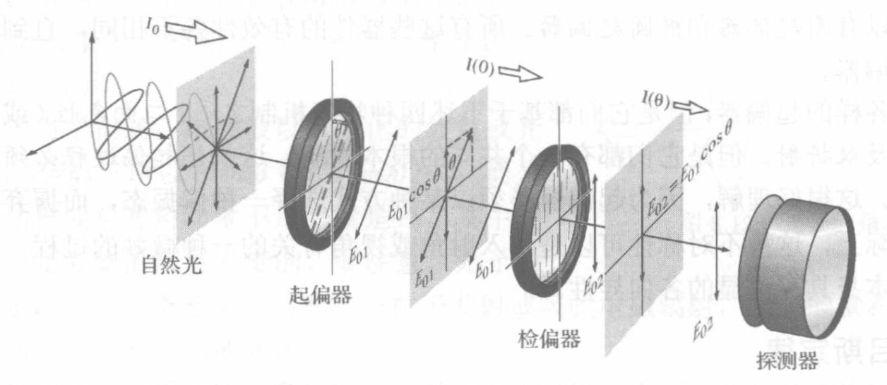

### 8.3 双折射

在各向异性晶体中，介电常数（因而折射率）依赖于偏振方向相对于晶轴的方向。扩展至各向异性介质的洛伦兹振子模型给出
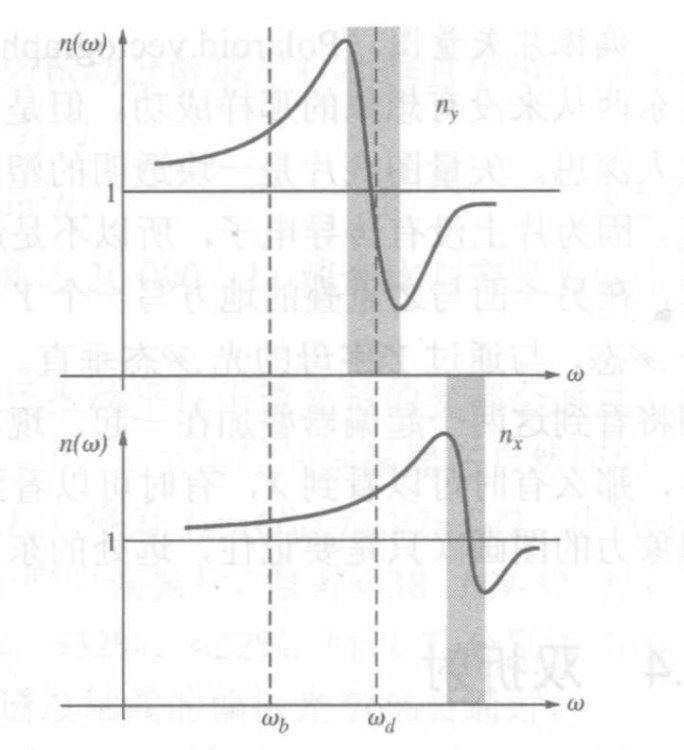

$$
n^{2}(\omega) = 1 + \frac{N q_e^{2}}{\epsilon_0 m_e}\left(\frac{1}{\omega_0^{2} - \omega^{2}}\right)
$$

其中不同晶体方向的共振频率 $\omega_0$ 不同。这导致对于同一个频率的光，若偏振方向不同，则经历的折射率也不同，如右图所示。

#### 单轴晶体

双折射晶体中最重要的类型是单轴晶体（如方解石 CaCO$_3$），它们具有一个特殊方向称为光轴，沿此方向传播的光不经历双折射。换句话说，单轴晶体关于光轴有旋转对称性。

当一束非偏振光入射单轴晶体时，会分裂为两束偏振相互正交的光：

- 寻常光（o 光）：偏振方向垂直于光轴与传播方向构成的平面（主截面）。o 光遵守斯涅尔定律，其折射率 $n_o$ 与传播方向无关，在各个方向均为常数。

- 非常光（e 光）：偏振方向平行于主截面。e 光通常不遵守斯涅尔定律，因为折射率 $n=n(\theta)$，依赖于出射角 $\theta$。当光沿光轴传播时 $n = n_o$；垂直于光轴传播时 $n$ 取极值（记为 $n_e$）。$|n_e - n_o|$ 称为双折射率，表征晶体的各向异性程度。

在吸收带附近，o 光和 e 光的吸收系数不同，因此沿不同方向观察颜色不同，称：材料呈现二向色性。

#### 光轴平行于表面

考虑光轴位于晶体表面平面内，设光垂直于平面入射，则 o 光和 e 光沿同一方向传播（不偏折），但二者经历不同的折射率 $n_o$ 和 $n_e$，因此以不同的速度传播。

设晶体厚度为 $d$，取光轴方向为 $\hat{i}$（x 轴），与之垂直的方向为 $\hat{j}$（y 轴）。入射光为与 x 轴成任意角度的线偏振光：

$$
\vec{E}(z, t) = \hat{i}E_{0x}e^{i(k_xz-\omega t)} + \hat{j}E_{0y}e^{i(k_yz-\omega t)},
$$

在晶体内部，两个方向的波数 $k$ 发生变化：

$$
k_i = \frac{2\pi}{\lambda_i} = \frac{2\pi}{\lambda_0}n_i, \, i=o, e, \qquad \lambda_0 = \frac{2\pi c}{\omega}
$$

因此经过距离 $d$ 两分量之间的相位差为：

$$
\Delta\phi = k_e d - k_o d = \frac{2\pi}{\lambda_0}\,d\,(n_e - n_o),
$$

因此通过控制厚度 $d$，可精确调控相位差 $\Delta\phi$，这正是波片的工作原理：

#### 波片

**半波片（$\Delta\phi = \pi$）：** 出射 o 和 e 分量相位差 $\lambda/2$。它将线偏振光的偏振方向旋转 $2\theta$（$\theta$ 为输入偏振方向与快轴的夹角），并反转圆/椭圆偏振的手性。厚度：

$$
d\,|n_o - n_e| = (2m+1)\frac{\lambda_0}{2}, \qquad m = 0,1,2,\dots
$$

**四分之一波片（$\Delta\phi = \pi/2$）：** 将线偏振光转换为圆（或椭圆）偏振光，反之亦然。当输入线偏振与任一主轴成 $45^{\circ}$ 时，输出为圆偏振光。厚度：

$$
d\,|n_o - n_e| = (4m+1)\frac{\lambda_0}{4}, \qquad m = 0,1,2,\dots
$$

注意：波片的作用效果取决于光的偏振方向与其快轴（较小折射率的方向）的夹角。比如四分之一波片，与其快轴平行的偏振光不受任何影响，而与其成 $45^\circ$ 的偏振光变为圆偏振光。

### 8.4 斯托克斯矢量和琼斯矢量

#### 琼斯矢量

全偏振单色光束用**琼斯矢量**表示：

$$
\tilde{\mathbf{E}} = \begin{bmatrix} \tilde{E}_x \\ \tilde{E}_y \end{bmatrix}
$$

这里是复场，携带相位信息。

琼斯矢量的内积是有意义的：它真的衡量两个偏振态之间的夹角。琼斯矢量只能描述偏振光。

#### 斯托克斯矢量

对部分偏振光的完整描述使用四个可测量的强度定义斯托克斯矢量：

$$
\begin{aligned}
S_0 &= 2I_0 &&\text{（总辐照度）} \\
S_1 &= 2I_1 - 2I_0 &&\text{（水平偏好）} \\
S_2 &= 2I_2 - 2I_0 &&\text{（+45° 偏好）} \\
S_3 &= 2I_3 - 2I_0 &&\text{（右旋圆偏好）}
\end{aligned}
$$

其中 $I_0$ 通过各向同性的滤光片，$I_1$ 通过 $90^{\circ}$ 偏振片，$I_2$ 通过 $+45^{\circ}$ 偏振片，$I_3$ 通过右圆偏振器测量。通常对每个分量除以 $S_0$ 归一化。

若电场写作：

$$
E_x(z, t) = E_{0x}(t)\cos\left(kz-\omega t + \epsilon_x(t)\right), \qquad E_y(z, t) = E_{0y}(t)\cos\left(kz-\omega t + \epsilon_y(t)\right), \qquad \epsilon(t) \equiv \epsilon_y(t) - \epsilon_x(t),
$$

用时间平均场分量表示：

$$
\begin{aligned}
S_0 &= \langle E_{0x}^{2} \rangle_T + \langle E_{0y}^{2} \rangle_T \\
S_1 &= \langle E_{0x}^{2} \rangle_T - \langle E_{0y}^{2} \rangle_T \\
S_2 &= \langle 2E_{0x}E_{0y}\cos\epsilon \rangle_T \\
S_3 &= -\langle 2E_{0x}E_{0y}\sin\epsilon \rangle_T
\end{aligned}
$$

其中 $\epsilon = \epsilon_y - \epsilon_x$ 为相对相位。

:::warning[勘误]

Hecht 书（第五版）上给出：$S_3 = \langle 2E_{0x}E_{0y}\sin\epsilon \rangle_T$，这是有问题的，在约定右旋偏振光为 $(1, -i)$（琼斯矢量）时，可以发现算出来的斯托克斯矢量是 $(1, 0, 0, -1)$，这与他书上给出的表格是矛盾的。

:::

斯托克斯矢量的内积没有意义。其加和的确表示光的叠加，但相位信息没有保留。斯托克斯矢量可以描述非偏振光。

#### 琼斯矢量与斯托克斯矢量对照

| 状态 | 斯托克斯矢量 | 琼斯矢量 | 状态 | 斯托克斯矢量 | 琼斯矢量 |
|------|--------------------------|----------|------|--------------------------|----------|
| 非偏振 | $\begin{bmatrix} 1 \\ 0 \\ 0 \\ 0 \end{bmatrix}$ | — | 线偏振 $+45^{\circ}$ | $\begin{bmatrix} 1 \\ 0 \\ 1 \\ 0 \end{bmatrix}$ | $\dfrac{1}{\sqrt{2}}\begin{bmatrix} 1 \\ 1 \end{bmatrix}$ |
| 线偏振水平 | $\begin{bmatrix} 1 \\ 1 \\ 0 \\ 0 \end{bmatrix}$ | $\begin{bmatrix} 1 \\ 0 \end{bmatrix}$ | 右旋圆偏振 | $\begin{bmatrix} 1 \\ 0 \\ 0 \\ 1 \end{bmatrix}$ | $\dfrac{1}{\sqrt{2}}\begin{bmatrix} 1 \\ -i \end{bmatrix}$ |
| 线偏振竖直 | $\begin{bmatrix} 1 \\ -1 \\ 0 \\ 0 \end{bmatrix}$ | $\begin{bmatrix} 0 \\ 1 \end{bmatrix}$ | 左旋圆偏振 | $\begin{bmatrix} 1 \\ 0 \\ 0 \\ -1 \end{bmatrix}$ | $\dfrac{1}{\sqrt{2}}\begin{bmatrix} 1 \\ i \end{bmatrix}$ |

### 8.5 偏振光学元件的矩阵表达

光学元件对偏振态的作用可用两种矩阵描述：**琼斯矩阵**（$2\times 2$ 复矩阵，仅适用于全偏振光）和**穆勒矩阵**（$4\times 4$ 实矩阵，适用于任意偏振态）。琼斯算法：$\tilde{\mathbf{E}}_t = \mathbf{J}\,\tilde{\mathbf{E}}_i$；穆勒算法：$\mathbf{S}_t = \mathbf{M}\,\mathbf{S}_i$。级联元件按光路顺序从右向左乘。

**相位约定**：四分之一波片快轴水平时携带全局相位 $e^{i\pi/4}$，使快、慢轴分量对称地获得 $\pm i\pi/4$ 的相移。

| 元件 | 琼斯矩阵 | 穆勒矩阵 | 元件 | 琼斯矩阵 | 穆勒矩阵 |
|------|---------|---------|------|---------|---------|
| 水平起偏器 | $\begin{bmatrix} 1 & 0 \\ 0 & 0 \end{bmatrix}$ | $\dfrac{1}{2}\begin{bmatrix} 1 & 1 & 0 & 0 \\ 1 & 1 & 0 & 0 \\ 0 & 0 & 0 & 0 \\ 0 & 0 & 0 & 0 \end{bmatrix}$ | $\lambda/4$ 波片（快轴水平） | $\begin{bmatrix} e^{i\pi/4} & 0 \\ 0 & e^{-i\pi/4} \end{bmatrix}$ | $\begin{bmatrix} 1 & 0 & 0 & 0 \\ 0 & 1 & 0 & 0 \\ 0 & 0 & 0 & -1 \\ 0 & 0 & 1 & 0 \end{bmatrix}$ |
| 竖直起偏器 | $\begin{bmatrix} 0 & 0 \\ 0 & 1 \end{bmatrix}$ | $\dfrac{1}{2}\begin{bmatrix} 1 & -1 & 0 & 0 \\ -1 & 1 & 0 & 0 \\ 0 & 0 & 0 & 0 \\ 0 & 0 & 0 & 0 \end{bmatrix}$ | $\lambda/4$ 波片（快轴竖直） | $\begin{bmatrix} e^{-i\pi/4} & 0 \\ 0 & e^{i\pi/4} \end{bmatrix}$ | $\begin{bmatrix} 1 & 0 & 0 & 0 \\ 0 & 1 & 0 & 0 \\ 0 & 0 & 0 & 1 \\ 0 & 0 & -1 & 0 \end{bmatrix}$ |
| $+45^{\circ}$ 起偏器 | $\dfrac{1}{2}\begin{bmatrix} 1 & 1 \\ 1 & 1 \end{bmatrix}$ | $\dfrac{1}{2}\begin{bmatrix} 1 & 0 & 1 & 0 \\ 0 & 0 & 0 & 0 \\ 1 & 0 & 1 & 0 \\ 0 & 0 & 0 & 0 \end{bmatrix}$ | 右旋起偏器 | $\dfrac{1}{2}\begin{bmatrix} 1 & i \\ -i & 1 \end{bmatrix}$ | $\dfrac{1}{2}\begin{bmatrix} 1 & 0 & 0 & 1 \\ 0 & 0 & 0 & 0 \\ 0 & 0 & 0 & 0 \\ 1 & 0 & 0 & 1 \end{bmatrix}$ |
| $-45^{\circ}$ 起偏器 | $\dfrac{1}{2}\begin{bmatrix} 1 & -1 \\ -1 & 1 \end{bmatrix}$ | $\dfrac{1}{2}\begin{bmatrix} 1 & 0 & -1 & 0 \\ 0 & 0 & 0 & 0 \\ -1 & 0 & 1 & 0 \\ 0 & 0 & 0 & 0 \end{bmatrix}$ | 左旋起偏器 | $\dfrac{1}{2}\begin{bmatrix} 1 & -i \\ i & 1 \end{bmatrix}$ | $\dfrac{1}{2}\begin{bmatrix} 1 & 0 & 0 & -1 \\ 0 & 0 & 0 & 0 \\ 0 & 0 & 0 & 0 \\ -1 & 0 & 0 & 1 \end{bmatrix}$ |

---

## Chapter 9：干涉

### 9.1 干涉条件

两列波产生稳定干涉图样需要：
1. 相同频率；
2. 相干性：
   - 时间相干性：确保光程差在相干长度以内。
   - 空间相干性：确保光源不同点发出的光能够干涉。

### 9.2 等倾条纹（海丁格条纹）

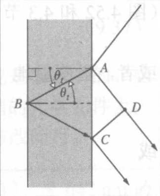

折射率为 $n_f$、厚度为 $d$ 的平行平板，两侧介质为 $n_1, n_2$。

$AD$ 光程：

$$
AD = AC\sin\theta_i = AC\frac{n_f}{n_1}\sin\theta_t = 2d\tan\theta_t \cdot \frac{n_f}{n_1}\sin\theta_t \Longrightarrow \Lambda_1 = 2n_fd\tan\theta_t\sin\theta_t 
$$

$AB-BC$ 光程：

$$
AB+BC = \frac{2d}{\cos\theta_t} \Longrightarrow \Lambda_f = \frac{2n_fd}{\cos\theta_t}
$$

光程差：

$$
\Lambda = \Lambda_1 - \Lambda_f = \frac{2n_fd}{\cos\theta_t}(1-\sin^2\theta_t) = 2n_fd\cos\theta_t.
$$

上下表面反射光满足相干性条件，可以产生干涉条纹：

1. $n_1 = n_2 = n$ 且 $n_f > n$ 或 $n_f < n$。一个反射面发生 $\pi$ 相位跃变（菲涅尔方程中一侧振幅变号）：$\delta = k_0\Lambda \pm \pi$，这里取负号，可以简化形式。因此：
- 极大 $\delta = 2m\pi$：$\;d\cos\theta_t = (2m+1)\dfrac{\lambda_f}{4}$；
- 极小 $\delta = (2m\pm 1)\pi$：$\;d\cos\theta_t = 2m\dfrac{\lambda_f}{4}$。

2. $n_1 > n_f > n_2$ 或 $n_1 < n_f < n_2$，此时两个反射均为外反射或均为内反射，无相对 $\pi$ 相移。极大和极小条件互换。

这些条纹定域在无穷远（或透镜焦平面内）。对于给定的 $d$，每个 $\theta_t$ 对应特定的级次 $m$，产生同心圆环（海丁格条纹）。

### 9.3 等厚条纹

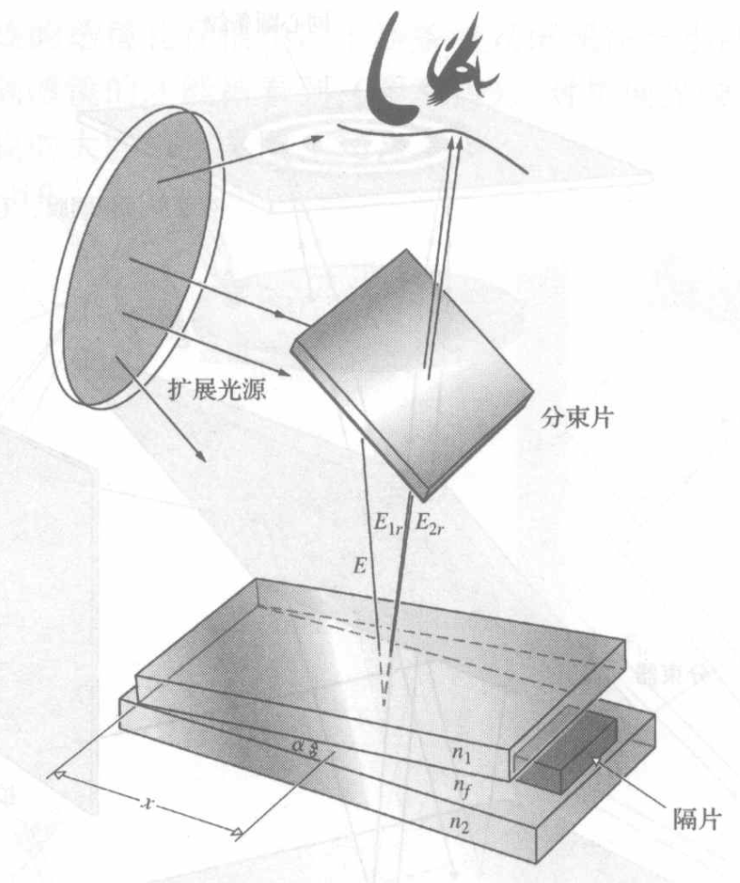

对于小角度 $\alpha$ 的薄楔形（$\alpha \ll 1$），近乎正入射（$\theta_t \approx \theta_i \approx 0$）：

$$
\Lambda = 2n_f d, \qquad d = x\alpha
$$

一个界面存在 $\pi$ 相移时，与等倾条纹类似：$k_0\Lambda -\pi = 2m\pi$，解得：
$$
d_m = \left(m + \frac{1}{2}\right)\frac{\lambda_f}{2}, \qquad
x_m = \frac{(m + 1/2)}{2\alpha}\,\lambda_f
$$

条纹为平行于楔形顶点的等间距直线，间距 $\Delta x = \lambda_f/(2\alpha)$。球面与平面接触时，得到牛顿环图样，与上述推导相同，仅作替换 $x^2=2Rd$。

### 9.4 干涉仪（迈克尔逊）

迈克尔逊干涉仪将光束分束，使两部分沿不同路径传播，然后重新合束。补偿板（与分束器完全相同）确保两束光通过相同厚度的玻璃，均衡色散，使得白光条纹可被观测。条纹图样可揭示小至几分之一波长的光程差，使迈克尔逊干涉仪成为极其灵敏的测量工具。

### 9.5 增透膜 — 传输矩阵法

两个半无限介质之间的薄介电膜可通过相消干涉抑制反射。

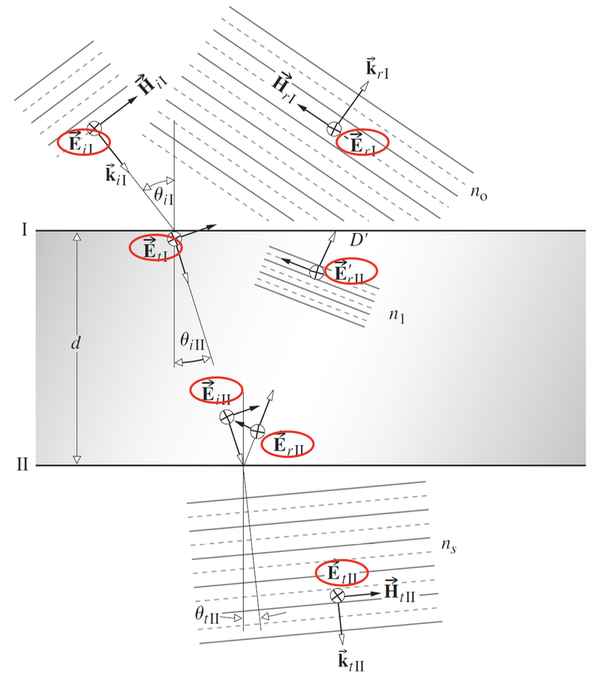

设界面平行于 $xy$ 面，法向取 $z$，入射面取 $xz$ 面。如图，电场只在 $y$ 方向有分量（$s$ 偏振）：

$$
\vec E = E_y \hat y.
$$

层内总电场写作：

$$
E_y(z)=A e^{ik_z z}+B e^{-ik_z z},
$$

其中：

$$
k_z=n_1k_0\cos\theta_t, \qquad k_0=\frac{2\pi}{\lambda_0}.
$$

$\lambda_0$ 是真空波长。这里略去了横向的相因子 $e^{ik_xx}$，因为它沿着水平方向守恒，给出的只是斯涅尔定律。$\theta_t$ 指的就是这里的 $\theta_{iII}$，我觉得没有必要弄这么复杂的记号。

对于电磁波总有：

$$
\vec{B} = \frac{1}{\omega}\left(\vec{k} \times \vec{E} \right), \qquad \vec H = \frac{1}{\mu_0} \vec B,
$$

推导出磁场：

$$
\vec H = \frac{1}{\omega\mu_0}\vec k\times\vec E.
$$

按照这里的约定 $\vec k=(k_x,0,k_z)$，而$\vec E=(0,E,0)$，因此

$$
\vec k\times\vec E = (-k_zE,0,k_xE).
$$

所以

$$
H_x = -\frac{k_z}{\omega\mu_0}E = -\frac{n_1\cos\theta_t}{\mu_0 c}E = - \sqrt{\frac{\epsilon_0}{\mu_0}}n\cos\theta_t E
$$

忽略掉 $H_z$ 分量，它被电场直接唯一确定，不涉及到边界条件的讨论。

定义：

$$
\gamma_1 = \sqrt{\frac{\epsilon_0}{\mu_0}} n_1\cos\theta_t
$$

因此总磁场可以写为：

$$
H(z) = -\gamma_1 A e^{ik_z z} + \gamma_1 B e^{-ik_z z}.
$$

注意：膜厚为 $d$，因此 $I$ 处的场：

$$
E(0)=A+B, \qquad H(0)=\gamma_1(B-A).
$$

$II$ 处的场：

$$
E(d)=Ae^{i\delta}+Be^{-i\delta}, \qquad H(d) = \gamma_1 \left(Be^{-i\delta} - Ae^{i\delta}\right),
$$

其中：

$$
\delta = k_z d = \frac{2\pi}{\lambda_0}n_1d\cos\theta_t
$$

对 $II$ 处场进行变形，反解出：

$$
A = e^{-i\delta} \frac12 \left(E(d)-\frac{H(d)}{\gamma_1}\right),
\qquad
B = e^{i\delta} \frac12 \left(E(d)+\frac{H(d)}{\gamma_1}\right).
$$

代回 $I$ 处场：

$$
E(0) = \cos\delta\,E(d) + \frac{i\sin\delta}{\gamma_1} H(d),
$$
$$
H(0)= i\gamma_1\sin\delta\,E(d) + \cos\delta\,H(d),
$$

于是

$$
\begin{pmatrix}
E(0)\\
H(0)
\end{pmatrix}
=
\begin{pmatrix}
\cos\delta & \dfrac{i\sin\delta}{\gamma_1}
\\[6pt]
i\gamma_1\sin\delta & \cos\delta
\end{pmatrix}
\begin{pmatrix}
E(d)\\
H(d)
\end{pmatrix}
$$

这就是单层膜的特征矩阵 $\mathcal{M}$。换回 Hecht 的记号：

$$
\begin{pmatrix}
E_I\\
H_I
\end{pmatrix}
=
\begin{pmatrix}
\cos(k_0h) & \dfrac{i\sin(k_0h)}{\gamma_1}
\\[6pt]
i\gamma_1\sin(k_0h) & \cos(k_0h)
\end{pmatrix}
\begin{pmatrix}
E_{II}\\
H_{II}
\end{pmatrix}
$$

其中 $\delta = k_z d = k_0 h$，$h$ 定义为：

$$
h = \frac{k_zd}{k_0} = n_1 d \cos\theta_{iII}.
$$

对于 $p$ 层膜，总矩阵为乘积 $\mathcal{M} = \mathcal{M}_1 \mathcal{M}_2 \cdots \mathcal{M}_p$。注意：将上式改写为：

$$
\begin{pmatrix} E_{iI} + E_{rI} \\ -\gamma_0(E_{iI} - E_{rI}) \end{pmatrix}
= \mathcal{M} \begin{pmatrix} E_{tII} \\ -\gamma_s E_{tII} \end{pmatrix}
$$

也即将电场拆成入射成分与反射成分，并将磁场（$\vec{H}$）用电场表示出来。

反射系数和透射系数为

$$
r \equiv \frac{E_{rI}}{E_{iI}}= \frac{\gamma_0 m_{11} + \gamma_0\gamma_s m_{12} - m_{21} - \gamma_s m_{22}}
        {\gamma_0 m_{11} + \gamma_0\gamma_s m_{12} + m_{21} + \gamma_s m_{22}},
\qquad
t \equiv \frac{E_{tII}}{E_{iI}} = \frac{2\gamma_0}{\gamma_0 m_{11} + \gamma_0\gamma_s m_{12} + m_{21} + \gamma_s m_{22}}
$$

其中：

$$
\gamma_{0} = \sqrt{\frac{\epsilon_0}{\mu_0}} n_1\cos\theta_{iI}, \qquad \gamma_{0} = \sqrt{\frac{\epsilon_0}{\mu_0}} n_s\cos\theta_{tII},
$$

例子：单层四分之一波长增透膜：正入射（$\theta_{iI} = \theta_{iII} = \theta_{tII} = 0$），当 $k_0 h = \pi/2$（即厚度 $d = \lambda_0/4$）：

$$
R = \frac{(n_0 n_s - n_1^{2})^{2}}{(n_0 n_s + n_1^{2})^{2}}
$$

当 $n_0n_s = n_1^2$ 时，$R = 0$，此时无反射。

双层增透膜：两层上述薄膜叠加，折射率分别为 $n_1, n_2$，均满足 $k_0h=\pi/2$，正入射下：
$$
\mathcal M = \mathcal M_1 \mathcal M_2 = \begin{pmatrix} 0 & i/\gamma_1 \\ i\gamma_1 & 0\end{pmatrix} \begin{pmatrix} 0 & i/\gamma_2 \\ i\gamma_2 & 0\end{pmatrix} = \begin{pmatrix} -n_2/n_1 & 0 \\ 0 & -n_1/n_2 \end{pmatrix},
$$

因此第二表面的反射系数：

$$
R_2 = \left(\frac{n_2^2n_0-n_sn_1^2}{n_2^2n_0+n_sn_1^2}\right)^2,
$$

因此当满足：

$$
\left(\frac{n_2}{n_1}\right)^{2} = \frac{n_s}{n_0}
$$

时，反射系数为 $0$。

---

## Chapter 10：衍射

### 10.1 无宽度狭缝

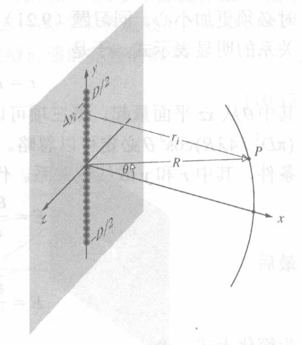

考虑一条狭缝如图，其上每一点，由惠更斯-菲涅尔原理，都可以看做是一个独立的点源发出一个球面波：

$$
E = \left(\frac{\bm \varepsilon_0}{r}\right) \sin(\omega t - kr),
$$

其中 $\bm \varepsilon_0$ 称为波源强度。我们将狭缝等分成 $N$ 份，取其中 $dy$ 长度，则有：

$$
dE = N\frac{dy}{D} \left(\frac{\bm \varepsilon_0}{r}\right) \sin(\omega t - kr) = \frac{N\bm\varepsilon_0}{D}\frac{\sin(\omega t - kr)}{r} dy,
$$

显然，当 $N \to \infty$ 时，单个源的波源强度必须趋于 $0$，从而使得狭缝整体发出有限强的电磁波，因此定义：

$$
\bm \varepsilon_L = \lim_{N\to\infty}\frac{N\bm\varepsilon_0}{D},
$$

则点 $P$ 处的场强可以写作：

$$
dE = \bm \varepsilon_L \frac{\sin(\omega t - kr)}{r} dy \Longrightarrow E = \bm \varepsilon_L\int_{-D/2}^{D/2}\frac{\sin(\omega t - kr)}{r} dy,
$$

其中 $r = r(y)$，依赖于点 $P$ 的选取。当 $R \gg D$ 时，有限长的狭缝近乎于点光源，此时可认为狭缝上每一点波的振幅都近似相等：

$$
dE = \bm \varepsilon_L \frac{\sin(\omega t - kr)}{R} dy,
$$

但相位变化更加敏感，需保留更高阶，否则狭缝就完全作为点光源处理了：

$$
r = R-y\sin\theta,
$$

因此场强：

$$
E = \frac{\bm \varepsilon_L}{R}\int_{-D/2}^{D/2}\sin\left[\omega t - k(R-y\sin\theta)\right] dy = \frac{\bm \varepsilon_L D}{R} \frac{\sin\left[(kD/2)\sin\theta\right]}{(kD/2)\sin\theta} \sin(\omega t - kR),
$$

记:

$$
\beta = \frac{kD}{2}\sin\theta
$$

因此：

$$
E = \frac{\bm \varepsilon_L D}{R} \frac{\sin\beta}{\beta} \sin(\omega t - kR),
$$

或者使用光强：

$$
I(\theta) = I(0) \left(\frac{\sin\beta}{\beta}\right)^2,
$$

其中 $I(0) = \dfrac{1}{2}\left(\dfrac{\bm \varepsilon_L D}{R}\right)^2$。

### 10.1 单缝

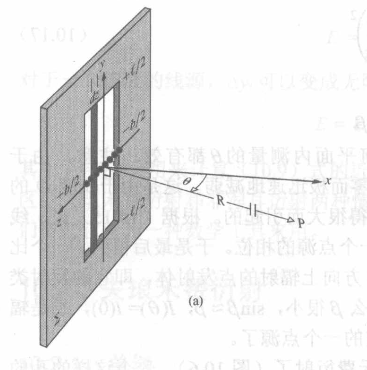

:::note

图片上的单缝宽度被远远夸大了。

:::

宽度为 $b$（长度 $\ell \gg \lambda$）的狭缝，可以沿着 $z$方向分解成无穷多条无宽度狭缝，这可以用点源近似。因此，它等价于先前推导的无宽度狭缝：

$$
I(\theta) = I(0)\left(\frac{\sin\beta}{\beta}\right)^{2},
\qquad
\beta = \frac{kb}{2}\sin\theta，
$$

其极值：

$$
\frac{dI}{d\beta} = I(0)\frac{2\sin\beta(\beta\cos\beta-sin\beta)}{\beta^3} = 0 \Longrightarrow \sin\beta=0 \;\text{or}\; \beta = \tan\beta
$$

- 主极大 ($\theta=0$)：$\beta = 0$
- 极小（$\sin\beta = 0$）：$\beta = \pm\pi, \pm 2\pi, \pm 3\pi, \dots$ 或 $b\sin\theta_m = m\lambda,\; m = \pm 1, \pm 2, \dots$
- 次级极大（$\tan\beta = \beta$）：$\beta \approx \pm 1.43\pi,\; \pm 2.46\pi,\; \pm 3.47\pi, \dots$

中央极大包含约 84% 的总衍射能量。

### 10.2 多缝

设 $N$ 条完全相同、等间距排列的狭缝。每条缝宽为 $b$，相邻缝中心间距为 $a$（$a > b$）。由[单缝](#101-单缝)的结论，单独一条缝（中心位于坐标原点）在远场 $P$ 点产生的场为：

$$
E_{\text{单缝}}(\theta) = \frac{\bm \varepsilon_L b}{R}\,\frac{\sin\beta}{\beta}\,\sin(\omega t - kR),
\qquad
\beta = \frac{kb}{2}\sin\theta.
$$

现在将 $N$ 条缝沿 $y$ 方向排列，第 $j$ 条缝的中心位于 $y_j = j a$（$j = 0, 1, \dots, N-1$）。它到 $P$ 点的距离为：

$$
r_j \approx R - y_j\sin\theta = R - j a\sin\theta,
$$

在远场条件下振幅衰减近似相同（分母均取 $R$），但相位差不可忽略。因此第 $j$ 条缝对场的贡献为：

$$
E_j(\theta) = \frac{\bm \varepsilon_L b}{R}\,\frac{\sin\beta}{\beta}\,\sin\!\big(\omega t - kR + j\cdot ka\sin\theta\big).
$$

定义相邻缝之间的相位差：

$$
2\alpha \equiv ka\sin\theta,
\qquad\text{即}\qquad
\alpha = \frac{ka}{2}\sin\theta.
$$

则总场为 $N$ 条缝的相干叠加：

$$
E(\theta) = \sum_{j=0}^{N-1} E_j
          = \frac{\bm \varepsilon_L b}{R}\,\frac{\sin\beta}{\beta}\,
            \sum_{j=0}^{N-1} \sin(\omega t - kR + 2j\alpha).
$$

利用欧拉公式，求和化为等比级数：

$$
\sum_{j=0}^{N-1} e^{i(\omega t - kR + 2j\alpha)}
= e^{i(\omega t - kR)} \sum_{j=0}^{N-1} \left(e^{i2\alpha}\right)^{j}
= e^{i(\omega t - kR)}\,\frac{1 - e^{i2N\alpha}}{1 - e^{i2\alpha}}.
$$

提取相位因子：

$$
\frac{1 - e^{i2N\alpha}}{1 - e^{i2\alpha}}
= \frac{e^{iN\alpha}(e^{-iN\alpha} - e^{iN\alpha})}
       {e^{i\alpha}(e^{-i\alpha} - e^{i\alpha})}
= e^{i(N-1)\alpha}\,\frac{\sin N\alpha}{\sin\alpha}.
$$

取虚部即得实正弦求和：

$$
\sum_{j=0}^{N-1} \sin(\omega t - kR + 2j\alpha)
= \frac{\sin N\alpha}{\sin\alpha}\,\sin\!\big(\omega t - kR + (N-1)\alpha\big).
$$

因此总场为：

$$
E(\theta) = \frac{\bm \varepsilon_L b}{R}\,\frac{\sin\beta}{\beta}\,
                 \frac{\sin N\alpha}{\sin\alpha}\,
                 \sin\!\big(\omega t - kR + (N-1)\alpha\big).
$$

辐照度正比于振幅平方，时间平均消去 $\sin^{2}$ 项，得：

$$
I(\theta) = I_0\left(\frac{\sin\beta}{\beta}\right)^{2}
                 \left(\frac{\sin N\alpha}{\sin\alpha}\right)^{2}.
$$

其中 $I_0$ 为单条缝在 $\theta=0$ 方向产生的强度，$I(0)=N^2I_0$。

#### 极值

**主极大：** 当 $\alpha = m\pi$（$m = 0, \pm 1, \pm 2, \dots$）时，分子分母同时为零，使用洛必达法则：

$$
\lim_{\alpha \to m\pi} \frac{\sin N\alpha}{\sin\alpha}
= \lim_{\alpha \to m\pi} \frac{N\cos N\alpha}{\cos\alpha}
= \pm N,
\qquad\Longrightarrow\qquad
\left(\frac{\sin N\alpha}{\sin\alpha}\right)^{2} \to N^{2}.
$$

因此主极大的角位置满足：

$$
\alpha = m\pi \;\Longrightarrow\; a\sin\theta_m = m\lambda,
\qquad m = 0, \pm 1, \pm 2, \dots
$$

这正是光栅方程。$m=0$ 为零级主极大（所有子波同相），强度为 $N^{2}I_0$。

**极小（零点）：** 分子为零而分母非零：

$$
\sin N\alpha = 0,\; \sin\alpha \neq 0
\;\Longrightarrow\;
\alpha = \pm\frac{\pi}{N},\; \pm\frac{2\pi}{N},\; \dots,\; \pm\frac{(N-1)\pi}{N},\;
\pm\frac{(N+1)\pi}{N},\; \dots
$$

即相邻主极大之间有 $N-1$ 个暗纹。

**辅极大：** 相邻两个极小（$\sin N\alpha = 0$）之间必有一个辅极大。辅极大的精确位置由强度对 $\alpha$ 求导为零给出，即干涉因子 $(\sin N\alpha/\sin\alpha)^{2}$ 的驻点条件：

$$
\frac{d}{d\alpha}\left(\frac{\sin N\alpha}{\sin\alpha}\right) = 0
\;\Longrightarrow\;
\tan N\alpha = N\tan\alpha. 
$$

这是一个超越方程，近似解：考虑到其分子变化较慢，而分母变化很快，极大值应出现在分子取极大值附近：

$$
|\sin N\alpha| \approx 1
\;\Longrightarrow\;
\alpha_p \approx \frac{(2p+1)\pi}{2N}, \qquad p = 1, 2, \dots, N-2.
$$

辅极大强度随 $N$ 增大迅速衰减。相邻主极大之间共有 $N-2$ 个辅极大。

**主极大的锐度：** 主极大两侧的第一零点位于 $\alpha = m\pi \pm \pi/N$，角宽度 $\Delta\alpha = 2\pi/N \propto 1/N$。因此缝数越多，主极大越锐利。

#### 缺级

当单缝衍射的极小恰好落在干涉主极大上时，该级次被抑制，称为**缺级**。单缝衍射极小条件为：

$$
b\sin\theta = p\lambda,\quad p = \pm 1, \pm 2, \dots
\qquad\Longleftrightarrow\qquad
\beta = p\pi.
$$

干涉主极大条件为：

$$
a\sin\theta = m\lambda,\quad m = 0, \pm 1, \pm 2, \dots
$$

两式联立：

$$
\frac{a}{b} = \frac{m}{p}.
$$

若 $a/b$ 为有理数，则某些干涉主极大与衍射极小重合。最典型的情形是 $a = m b$（$m$ 为整数），此时第 $\pm m, \pm 2m, \dots$ 级干涉主极大消失。中央衍射峰（$|\beta| < \pi$，即 $|\sin\theta| < \lambda/b$）内有 $2m-1$ 条亮干涉条纹（即 $m = 0, \pm 1, \dots, \pm(m-1)$ 级）。

---

### 10.3 双缝

作为 $N=2$ 的特例，干涉因子简化为：

$$
\left(\frac{\sin 2\alpha}{\sin\alpha}\right)^{2}
= \left(\frac{2\sin\alpha\cos\alpha}{\sin\alpha}\right)^{2}
= 4\cos^{2}\alpha.
$$

因此双缝的强度公式为：

$$
I_2(\theta) = 4I_0\left(\frac{\sin\beta}{\beta}\right)^{2}\cos^{2}\alpha,
\qquad
\alpha = \frac{ka}{2}\sin\theta = \frac{\pi a}{\lambda}\sin\theta.
$$

### 10.4 傅里叶联系

夫琅禾费衍射图样是孔径函数的**傅里叶变换**。例如，周期性矩形光栅（方波）可展开为傅里叶级数：

$$
f(x) = \frac{2}{a} + \sum_{m=1}^{\infty} \frac{4}{a}\,\mathrm{sinc}\!\left(\frac{2m\pi}{a}\right)\cos(m k x)
$$

每个傅里叶分量对应特定的衍射级次。sinc 包络反映单缝形状因子，而离散级次来源于周期性。这是傅里叶光学的基础。

---

### 10.5 圆孔衍射 —— 艾里斑

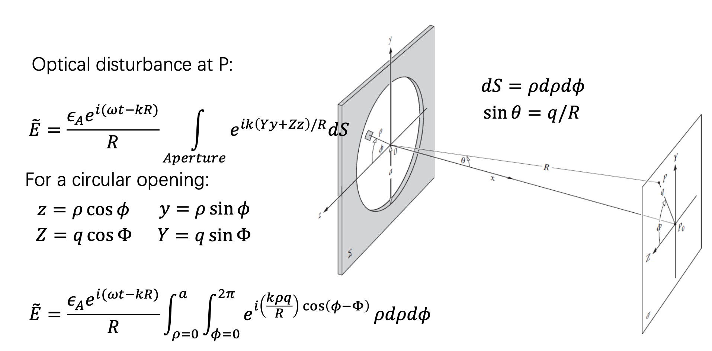

对于半径为 $a$（直径 $D = 2a$）的圆孔：

$$
I(\theta) = I(0)\left[\frac{2J_1(ka\sin\theta)}{ka\sin\theta}\right]^{2}
$$

其中 $J_1$ 为一阶贝塞尔函数。中央极大为艾里斑。第一暗环发生在

$$
ka\sin\theta = 3.83 \;\Longrightarrow\; \sin\theta_1 \approx 1.22\,\frac{\lambda}{D}
$$

在焦距为 $f$ 的透镜焦平面内，艾里斑到第一极小的半径为

$$
q_1 = 1.22\,\frac{\lambda f}{D}
$$

#### 瑞利判据

当两个非相干点源的一个艾里斑的中央极大恰好落在另一个的第一极小上时，二者恰好可分辨：

$$
(\Delta\theta)_{\min} = 1.22\,\frac{\lambda}{D}
$$

---

### 10.6 光栅方程

[10.2](#102-多缝) 中推导多缝主极大条件时假定了光**正入射**到光栅上。若光以角度 $\theta_i$（相对于光栅法线）斜入射，则需要修正相邻缝之间的相位差。

回顾多缝强度公式：

$$
I(\theta) = I_0\left(\frac{\sin\beta}{\beta}\right)^{2}\left(\frac{\sin N\alpha}{\sin\alpha}\right)^{2},
\qquad
\alpha = \frac{ka}{2}\sin\theta,
$$

其中 $\alpha$ 来自相邻缝到远场 $P$ 点的**程差** $a\sin\theta$。斜入射时，入射波本身在到达各缝时就已存在程差：第 $j$ 条缝比第 $j-1$ 条缝的入射光**少走**了 $a\sin\theta_i$ 的距离（设 $\theta_i$ 与 $\theta$ 在法线同侧时取正）。因此相邻缝之间、从光源到观测点的**总程差**变为：

$$
\Delta r = a\sin\theta - a\sin\theta_i = a(\sin\theta - \sin\theta_i).
$$

相应地，相邻缝的相位差修正为：

$$
2\alpha' = k\,\Delta r = ka(\sin\theta - \sin\theta_i),
\qquad\Longrightarrow\qquad
\alpha' = \frac{ka}{2}(\sin\theta - \sin\theta_i).
$$

多缝强度公式的形式**完全不变**——只需将 $\alpha$ 替换为 $\alpha'$ 即可。主极大条件 $\alpha' = m\pi$ 给出：

$$
a(\sin\theta_m - \sin\theta_i) = m\lambda, \qquad m = 0, \pm 1, \pm 2, \dots
$$

此即**光栅方程**。其中 $a$ 为光栅周期（刻线密度的倒数）；$m$ 为衍射级次。$m=0$ 对应零级——此时 $\theta_0 = \theta_i$，即出射方向等于入射方向（镜面反射/直透），不携带波长信息；$|m| \ge 1$ 的各级则将不同波长分散到不同角度，这正是光栅作为色散元件的基础。

### 10.8 闪耀光栅

闪耀反射光栅的刻槽面倾斜**闪耀角** $\gamma$。单面衍射包络（$\sin\beta/\beta$）被平移，使其峰值与所需的非零衍射级次重合，将大部分衍射能量集中到特定波长范围的该级次中。

### 10.9 角色散

角色散衡量不同波长的光被光栅分开的**角距离**有多大。对光栅方程两边求导（固定入射角 $\theta_i$）：

$$
a\cos\theta_m \, d\theta = m \, d\lambda
\qquad\Longrightarrow\qquad
\frac{d\theta}{d\lambda} = \frac{m}{a\cos\theta_m}.
$$

更高级次（$|m|$ 大）和更细的刻线间距（$a$ 小）给出更大的角色散。但角色散只是色分辨的**一个方面**——谱线能否被分辨，还取决于每条谱线自身的**宽度**。

### 10.10 色分辨本领

#### 主极大的角宽度

回看 [§10.2](#102-多缝) 中关于主极大锐度的结论：第 $m$ 级主极大位于 $\alpha = m\pi$，其两侧第一零点在 $\alpha = m\pi \pm \pi/N$。因此在 $\alpha$ 空间中，主极大的**半角宽**为 $\Delta\alpha = \pi/N$。

将 $\alpha = \frac{ka}{2}\sin\theta = \frac{\pi a}{\lambda}\sin\theta$ 对 $\theta$ 微分：

$$
d\alpha = \frac{\pi a}{\lambda}\cos\theta \, d\theta.
$$

令 $d\alpha = \Delta\alpha = \pi/N$，得第 $m$ 级主极大在 $\theta$ 空间中的**半角宽**（从峰顶到第一零点的角距离）：

$$
\boxed{(\Delta\theta)_{\text{半}} = \frac{\lambda}{N a \cos\theta_m}}.
$$

主极大的**全角宽**（两侧第一零点之间）为 $2(\Delta\theta)_{\text{半}} = 2\lambda/(N a\cos\theta_m)$。缝数 $N$ 越大，主极大越窄——这正是 §10.2 中"锐度 $\propto 1/N$"的定量表述。

#### 瑞利判据 → 色分辨本领

现在考虑两个波长 $\lambda$ 和 $\lambda + \Delta\lambda$（$\Delta\lambda \ll \lambda$），它们通过光栅后分别在第 $m$ 级产生主极大。两主极大的**角间距**由角色散给出：

$$
\Delta\theta_{\lambda} = \frac{d\theta}{d\lambda}\,\Delta\lambda = \frac{m}{a\cos\theta_m}\,\Delta\lambda.
$$

根据瑞利判据，当一条谱线的主极大恰好落在另一条谱线的第一零点上时，二者**恰好可分辨**。即要求角间距等于半角宽：

$$
\Delta\theta_{\lambda} = (\Delta\theta)_{\text{半}}
\;\Longrightarrow\;
\frac{m}{a\cos\theta_m}\,\Delta\lambda_{\min} = \frac{\lambda}{N a \cos\theta_m}.
$$

消去 $a\cos\theta_m$，得最小可分辨波长差：

$$
\Delta\lambda_{\min} = \frac{\lambda}{mN}.
$$

**色分辨本领**定义为：

$$
\boxed{\mathcal{R} \equiv \frac{\lambda}{\Delta\lambda_{\min}} = mN}.
$$

利用光栅方程 $a(\sin\theta_m - \sin\theta_i) = m\lambda$，也可写作：

$$
\boxed{\mathcal{R} = \frac{N a (\sin\theta_m - \sin\theta_i)}{\lambda}}.
$$

两个关键因子一目了然：**$m$**——使用更高级次可提高分辨本领；**$N$**——刻线总数越多（光栅越大或刻线越密），谱线越锐利，分辨本领越高。